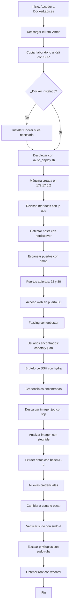

# Taller Habilidades en el Ciberespacio

## **Puntos a desarrollar**

1.	Realizar una investigación individual de cada una de las herramientas empleadas. Sintetice el resultado mediante un cuadro que explique su definición, funcionalidad y casos de uso.

2.	Explicar en detalle cada uno de los comandos empleados en el anterior CTF; realizando un desglose del mismo y citando al menos tres alternativas (si aplica) de variantes del comando para las herramientas empleadas, este punto amplia el ejercicio anterior.

3.	Realice un diagrama de flujo de todo el procedimiento realizado.

## **DESARROLLO**

1.	**HERRAMIENTAS EMPLEADAS**
   
| Herramienta | Definición | Funcionalidad | Casos de uso relevantes |
|-------------|-----------|--------------|-------------------------|
| **Docker** | Plataforma open-source de contenedores que aísla aplicaciones y sus dependencias | Empaqueta software en contenedores portátiles y reproducibles | Desarrollo ágil, despliegue continuo, pruebas consistentes |
| **Nmap** | Utilidad de escaneo de red y auditoría de seguridad | Detecta puertos, servicios, versiones y SO | Inventario de red, evaluación de vulnerabilidades, verificación de servicios |
| **Hydra** | Cracker de contraseñas rápido para múltiples protocolos | Ejecuta ataques de fuerza bruta automatizados en servicios remotos | Pentesting de autenticaciones SSH, FTP, HTTP, etc. |
| **netdiscover** | Escáner ARP activo/pasivo | Descubre hosts activos y sus direcciones MAC en la LAN | Reconocimiento rápido de dispositivos desconocidos en redes locales |
| **gobuster** | Herramienta de fuerza bruta para directorios y archivos web | Encuentra rutas/archivos ocultos usando diccionarios | Fuzzing de aplicaciones web, enumeración de infraestructura |
| **scp** | Protocolo seguro de copia de archivos sobre SSH | Transfiere archivos cifrados entre hosts locales/remotos | Respaldos, transferencia de evidencias forenses, despliegues seguros |
| **steghide** | Utilidad de esteganografía para imágenes/audio | Inserta o extrae datos ocultos dentro de archivos portadores | Análisis forense, ocultamiento legítimo de información sensible |
| **su / sudo** | Comandos de cambio de usuario y elevación de privilegios | Ejecuta órdenes como otro usuario o como root | Administración del sistema, escalada controlada de privilegios |

2.	**COMANDOS EMPLEADOS**

| Herramienta     | Comando                                                                                           | Función                                                                         | Parámetros                                                        | Variantes                                       | Caso real alternativo                                                                                                   |
|-----------------|--------------------------------------------------------------------------------------------------|----------------------------------------------------------------------------------|-------------------------------------------------------------------|-------------------------------------------------|-----------------------------------------------------------------------------------------------------------------------|
| netdiscover     | sudo netdiscover -i docker0 -r 172.17.0.0/24                                                      | Escanea la interfaz docker0 en el rango 172.17.0.0/24 para detectar hosts activos. | -i docker0: Interfaz de red.   -r 172.17.0.0/24: Rango IP.     | -P: Modo pasivo. -s <intervalo>: Intervalo. | Detección de dispositivos IoT no autorizados en red universitaria tras jornada de mantenimiento.                      |
| nmap            | sudo nmap --min-rate 5000 -p- -sS -sV 172.17.0.2                                                  | Escaneo rápido de todos los puertos TCP y detección de servicios/versiones.       | --min-rate 5000: Escaneo rápido. -p-: Todos los puertos. -sS: SYN scan. -sV: Versiones. | -O (SO), -A (avanzado), -sU (UDP).              | Verificación de exposición accidental de servicios tras actualización masiva de servidores web municipales.            |
| gobuster        | gobuster dir -u http://172.17.0.2/ -w /usr/share/wordlists/dirbuster/directory-list-2.3-medium.txt| Fuerza bruta de rutas/directorios en un sitio web.                               | dir: Modo directorios. -u: URL. -w: Wordlist.               | -t (hilos), -x (extensiones).                  | Búsqueda de paneles admin ocultos tras auditoría de portales de compras en línea.                                     |
| hydra           | hydra -l carlota -P /usr/share/wordlists/rockyou.txt ssh://172.17.0.2 -t 10                       | Fuerza bruta contra el servicio SSH.                                             | -l carlota: Usuario. -P: Diccionario. -t 10: Hilos.         | -L (usuarios), -M (IPs), -s (puerto).          | Simulación de ataque a empleados con credenciales débiles en fintech bajo peritaje legal.                             |
| scp             | scp carlota@172.17.0.2:/home/carlota/Desktop/fotos/vacaciones/imagen.jpg /home/kali/Documents/amor| Transferencia segura de archivos vía SSH.                                        | -r: Carpetas recursivas. -P <puerto>: Puerto específico.        |                                                 | Automatización de respaldo nocturno de archivos de routers en cadena de clínicas.                                      |
| steghide        | steghide --extract -sf imagen.jpg                                                                 | Extrae datos embebidos en imágenes/audio.                                        | --extract: Extrae. -sf: Archivo portador.                      | --embed (ocultar), -p (contraseña).            | Extracción de datos ocultos en archivos multimedia tras informe de fuga en una institución educativa.                  |
| su / sudo       | su oscar / sudo /usr/bin/ruby -e 'exec "/bin/bash"'                                               | Cambio de usuario y escalación de privilegios a root.                            | -c <comando>: Comando específico. -u <usuario>: Otro usuario.   |                                                 | Investigación forense sobre actividades sospechosas de cuentas privilegiadas en servidores de infraestructura crítica. |

   # **Ejemplos prácticos y salidas esperadas**

| Herramienta   | Comando de ejemplo                                               | Salida esperada resumida                                   |
|---------------|------------------------------------------------------------------|------------------------------------------------------------|
| netdiscover   | `sudo netdiscover -i eth0 -r 192.168.1.0/24`                     | Lista de IPs detectadas, MAC y fabricantes                 |
| nmap          | `sudo nmap -sS -p 22,80 192.168.1.10`                            | Detalle: puerto 22 (ssh) abierto, puerto 80 (http) cerrado |
| gobuster      | `gobuster dir -u http://192.168.1.15/ -w /tmp/miniwordlist.txt`  | `/admin (Status: 301)`, `/login (Status: 200)`             |

3.	** DIAGRAMA DE FLUJO DEL EJERCICIO**

# **REFERENCIAS**

1.	CBT Nuggets. (s.f.). Nmap Flags: What They Are & When to Use Them. Recuperado de https://www.cbtnuggets.com/blog/certifications/security/nmap-flags-what-they-are-when-to-use-them
2.	StationX. (s.f.). The Ultimate Nmap Cheat Sheet. Recuperado de https://www.stationx.net/nmap-cheat-sheet/
3.	CyberKraft Training. (2023). The Ultimate Nmap Cheat Sheet. Recuperado de https://cyberkrafttraining.com/blog/ultimate-nmap-cheat-sheet/
4.	Armur AI. (2023). Brute Forcing SSH Connections with Hydra [Tutorial]. Recuperado de https://armur.ai/tutorials/hydra/hydra/brute_force_ssh_connections/
5.	Kali Linux. (s.f.). Hydra | Kali Linux Tools. Recuperado de https://www.kali.org/tools/hydra/
6.	Mermaid.js. (s.f.). Mermaid Live Editor. Recuperado de https://mermaid.live/

