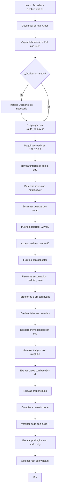

# Taller Habilidades en el Ciberespacio

## **Puntos a desarrollar**

1.	Realizar una investigación individual de cada una de las herramientas empleadas. Sintetice el resultado mediante un cuadro que explique su definición, funcionalidad y casos de uso.

2.	Explicar en detalle cada uno de los comandos empleados en el anterior CTF; realizando un desglose del mismo y citando al menos tres alternativas (si aplica) de variantes del comando para las herramientas empleadas, este punto amplia el ejercicio anterior.

3.	Realice un diagrama de flujo de todo el procedimiento realizado.

## **DESARROLLO**

1.	**HERRAMIENTAS EMPLEADAS**
   
| Herramienta | Definición | Funcionalidad | Casos de uso relevantes |
|-------------|-----------|--------------|-------------------------|
| **Docker** | Plataforma open-source de contenedores que aísla aplicaciones y sus dependencias | Empaqueta software en contenedores portátiles y reproducibles | Desarrollo ágil, despliegue continuo, pruebas consistentes |
| **Nmap** | Utilidad de escaneo de red y auditoría de seguridad | Detecta puertos, servicios, versiones y SO | Inventario de red, evaluación de vulnerabilidades, verificación de servicios |
| **Hydra** | Cracker de contraseñas rápido para múltiples protocolos | Ejecuta ataques de fuerza bruta automatizados en servicios remotos | Pentesting de autenticaciones SSH, FTP, HTTP, etc. |
| **netdiscover** | Escáner ARP activo/pasivo | Descubre hosts activos y sus direcciones MAC en la LAN | Reconocimiento rápido de dispositivos desconocidos en redes locales |
| **gobuster** | Herramienta de fuerza bruta para directorios y archivos web | Encuentra rutas/archivos ocultos usando diccionarios | Fuzzing de aplicaciones web, enumeración de infraestructura |
| **scp** | Protocolo seguro de copia de archivos sobre SSH | Transfiere archivos cifrados entre hosts locales/remotos | Respaldos, transferencia de evidencias forenses, despliegues seguros |
| **steghide** | Utilidad de esteganografía para imágenes/audio | Inserta o extrae datos ocultos dentro de archivos portadores | Análisis forense, ocultamiento legítimo de información sensible |
| **su / sudo** | Comandos de cambio de usuario y elevación de privilegios | Ejecuta órdenes como otro usuario o como root | Administración del sistema, escalada controlada de privilegios |

2.	**COMANDOS EMPLEADOS**
   
a) netdiscover
Comando usado:
Text: sudo netdiscover -i docker0 -r 172.17.0.0/24
•	Función: Escanea la interfaz docker0 en el rango de IPs 172.17.0.0/24 para detectar hosts activos.
•	Parámetros:
•	-i docker0: Especifica la interfaz de red.
•	-r 172.17.0.0/24: Rango de IP a analizar.
•	Variantes:
•	-P: Modo pasivo.
•	-s <intervalo>: Intervalo de escaneo.
Caso real alternativo:
Detección de dispositivos IoT conectados no autorizados en una red universitaria tras una jornada de mantenimiento.

b) nmap
Comando usado:
Text: sudo nmap --min-rate 5000 -p- -sS -sV 172.17.0.2
•	Función: Escaneo rápido de todos los puertos TCP y detección de servicios/versiones.
•	Parámetros:
•	--min-rate 5000: Escaneo rápido.
•	-p-: Todos los puertos.
•	-sS: SYN scan.
•	-sV: Detección de versiones.
•	Alternativas: -O (SO), -A (escaneo avanzado), -sU (puertos UDP).
Caso real alternativo:
Verificación de exposición accidental de servicios tras actualización masiva de servidores web municipales.

c) gobuster
Comando usado:
Text: gobuster dir -u http://172.17.0.2/ -w /usr/share/wordlists/dirbuster/directory-list-2.3-medium.txt
•	Función: Fuerza bruta de rutas/directorios en un sitio web.
•	Parámetros:
•	dir: Fuerza bruta modo directorios.
•	-u: URL objetivo.
•	-w: Wordlist.
•	Variantes: -t (hilos), -x (extensiones).
Caso real alternativo:
Búsqueda de paneles de administración ocultos tras una auditoría de portales de compras en línea.

d) hydra
Comando usado:
Text: hydra -l carlota -P /usr/share/wordlists/rockyou.txt ssh://172.17.0.2 -t 10
•	Función: Fuerza bruta contra el servicio SSH.
•	Parámetros:
•	-l carlota: Usuario.
•	-P: Diccionario de contraseñas.
•	-t 10: Hilos de ataque.
•	Variantes: -L (lista de usuarios), -M (IPs), -s (puerto).
Caso real alternativo:
Simulación de ataque por diccionario a cuentas de empleados con credenciales débiles en una pequeña fintech bajo peritaje legal.

e) scp
Comando usado:
Text: scp carlota@172.17.0.2:/home/carlota/Desktop/fotos/vacaciones/imagen.jpg /home/kali/Documents/amor
•	Función: Transferencia segura de archivos vía SSH.
•	Parámetros:
•	-r: Carpetas recursivas.
•	-P <puerto>: Puerto específico.
Caso real alternativo:
Automatización del respaldo nocturno de archivos de configuración de routers en sucursales de una cadena de clínicas.

f) steghide
Comando usado:
Text: steghide --extract -sf imagen.jpg
•	Función: Extrae datos embebidos en imágenes/audio.
•	Parámetros:
•	--extract: Extrae.
•	-sf: Archivo portador.
•	Variantes: --embed (ocultar), -p (contraseña).
Caso real alternativo:
Extracción de datos ocultos detectados en archivos multimedia tras un informe de posible fuga de información en una institución educativa.

g) su / sudo
Comandos usados:
•	su oscar: Cambia a usuario 'oscar'.
•	sudo /usr/bin/ruby -e 'exec "/bin/bash"': Eleva privilegios a root mediante Ruby.
•	Parámetros:
•	-c <comando>: Ejecuta un comando específico.
•	-u <usuario>: Ejecuta como otro usuario.
Caso real alternativo:
Investigación forense para determinar actividades sospechosas realizadas con cuentas privilegiadas en servidores de infraestructura crítica.

# **Ejemplos prácticos y salidas esperadas**

| Herramienta   | Comando de ejemplo                                               | Salida esperada resumida                                   |
|---------------|------------------------------------------------------------------|------------------------------------------------------------|
| netdiscover   | `sudo netdiscover -i eth0 -r 192.168.1.0/24`                     | Lista de IPs detectadas, MAC y fabricantes                 |
| nmap          | `sudo nmap -sS -p 22,80 192.168.1.10`                            | Detalle: puerto 22 (ssh) abierto, puerto 80 (http) cerrado |
| gobuster      | `gobuster dir -u http://192.168.1.15/ -w /tmp/miniwordlist.txt`  | `/admin (Status: 301)`, `/login (Status: 200)`             |

3.	** DIAGRAMA DE FLUJO DEL EJERCICIO**

# **REFERENCIAS**

1.	CBT Nuggets. (s.f.). Nmap Flags: What They Are & When to Use Them. Recuperado de https://www.cbtnuggets.com/blog/certifications/security/nmap-flags-what-they-are-when-to-use-them
2.	StationX. (s.f.). The Ultimate Nmap Cheat Sheet. Recuperado de https://www.stationx.net/nmap-cheat-sheet/
3.	CyberKraft Training. (2023). The Ultimate Nmap Cheat Sheet. Recuperado de https://cyberkrafttraining.com/blog/ultimate-nmap-cheat-sheet/
4.	Armur AI. (2023). Brute Forcing SSH Connections with Hydra [Tutorial]. Recuperado de https://armur.ai/tutorials/hydra/hydra/brute_force_ssh_connections/
5.	Kali Linux. (s.f.). Hydra | Kali Linux Tools. Recuperado de https://www.kali.org/tools/hydra/
6.	Mermaid.js. (s.f.). Mermaid Live Editor. Recuperado de https://mermaid.live/

