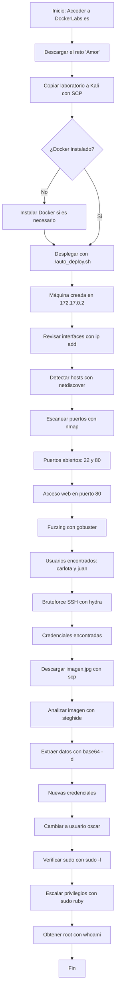

# Taller Habilidades en el Ciberespacio

## **Puntos a desarrollar**

1.	Realizar una investigación individual de cada una de las herramientas empleadas. Sintetice el resultado mediante un cuadro que explique su definición, funcionalidad y casos de uso.

2.	Explicar en detalle cada uno de los comandos empleados en el anterior CTF; realizando un desglose del mismo y citando al menos tres alternativas (si aplica) de variantes del comando para las herramientas empleadas, este punto amplia el ejercicio anterior.

3.	Realice un diagrama de flujo de todo el procedimiento realizado.

## **DESARROLLO**

1.	**HERRAMIENTAS EMPLEADAS**
 

| Herramienta | Definición | Funcionalidad | Casos de uso relevantes |
|-------------|-----------|--------------|-------------------------|
| **Docker** | Plataforma open-source de contenedores que aísla aplicaciones y sus dependencias | Empaqueta software en contenedores portátiles y reproducibles | Desarrollo ágil, despliegue continuo, pruebas consistentes |
| **Nmap** | Utilidad de escaneo de red y auditoría de seguridad | Detecta puertos, servicios, versiones y SO | Inventario de red, evaluación de vulnerabilidades, verificación de servicios |
| **Hydra** | Cracker de contraseñas rápido para múltiples protocolos | Ejecuta ataques de fuerza bruta automatizados en servicios remotos | Pentesting de autenticaciones SSH, FTP, HTTP, etc. |
| **netdiscover** | Escáner ARP activo/pasivo | Descubre hosts activos y sus direcciones MAC en la LAN | Reconocimiento rápido de dispositivos desconocidos en redes locales |
| **gobuster** | Herramienta de fuerza bruta para directorios y archivos web | Encuentra rutas/archivos ocultos usando diccionarios | Fuzzing de aplicaciones web, enumeración de infraestructura |
| **scp** | Protocolo seguro de copia de archivos sobre SSH | Transfiere archivos cifrados entre hosts locales/remotos | Respaldos, transferencia de evidencias forenses, despliegues seguros |
| **steghide** | Utilidad de esteganografía para imágenes/audio | Inserta o extrae datos ocultos dentro de archivos portadores | Análisis forense, ocultamiento legítimo de información sensible |
| **su / sudo** | Comandos de cambio de usuario y elevación de privilegios | Ejecuta órdenes como otro usuario o como root | Administración del sistema, escalada controlada de privilegios |

2.	**COMANDOS EMPLEADOS**

| Comando                                                                                           | Función detallada                                                                                                                                                                                                                          | Parámetros y variantes clave                                                                                                                                                                                                       | Caso real ampliado y contextualizado                                                                                                                          |
|---------------------------------------------------------------------------------------------------|-------------------------------------------------------------------------------------------------------------------------------------------------------------------------------------------------------------------------------------------|-----------------------------------------------------------------------------------------------------------------------------------------------------------------------------------------------------------------------------------|---------------------------------------------------------------------------------------------------------------------------------------------------------------|
| sudo netdiscover -i docker0 -r 172.17.0.0/24                                                      | Escanea la interfaz indicada (`docker0`) en el rango 172.17.0.0/24 buscando hosts activos mediante paquetes ARP, útil para descubrir dispositivos conectados a una red no documentada o dinámica. Evalúa visibilidad y segmentación de redes.                   | `-i docker0` (define la interfaz); `-r 172.17.0.0/24` (rango IP a analizar). `-P` (modo pasivo, solo escucha); `-s <intervalo>` (controla frecuencia de escaneo para adaptarse a redes lentas o muy activas).             | En una universidad, tras realizar un mantenimiento físico a los routers y switches, se sospecha que dispositivos IoT no autorizados se han reconectado. Se emplea netdiscover para identificar y eliminar riesgos de espionaje o saturación.         |
| sudo nmap --min-rate 5000 -p- -sS -sV 172.17.0.2                                                  | Realiza un escaneo muy rápido de todos los puertos TCP en el host, identificando no solo puertos abiertos, sino también intentando determinar el tipo exacto de servicio y su versión. Permite identificar superficies de ataque y evaluar exposición a vulnerabilidades.                   | `--min-rate 5000` (fuerza velocidad alta); `-p-` (todos los puertos), `-sS` (SYN scan para evitar conexiones completas); `-sV` (detección y banner grabbing de versiones). Alternativas: `-O` (detección SO), `-A` (escaneo avanzado), `-sU` (explora UDP). | Tras una actualización masiva de servidores web municipales, el área de TI realiza este escaneo para mitigar la ventana de exposición accidental de servicios críticos como SSH, bases de datos o aplicaciones sin protección por firewall.                 |
| gobuster dir -u http://172.17.0.2/ -w /usr/share/wordlists/dirbuster/directory-list-2.3-medium.txt | Ejecuta ataques de fuerza bruta dirigidos a la detección de directorios y archivos ocultos en aplicaciones web, descubriendo rutas no documentadas o protegidas por omisión. Es esencial en análisis de seguridad web y pruebas de caja negra.                                   | `dir` (modo exploración por carpetas); `-u` (URL de destino); `-w` (lista de posibles nombres de directorios/archivos). Variantes: `-t <num>` (cantidad de hilos concurrentes); `-x <.ext>` (busca archivos con extensiones específicas).       | Tras una auditoría, se detectan múltiples scripts de administración web inadvertidos en un portal de compras, lo que permite al equipo de seguridad recomendar bloqueos y actualizaciones de permisos sobre rutas sensibles expuestas.                        |
| hydra -l carlota -P /usr/share/wordlists/rockyou.txt ssh://172.17.0.2 -t 10                       | Permite realizar pruebas de fuerza bruta sobre servicios con autenticación, en este caso SSH, para validar robustez de credenciales de acceso y exponer posibles contraseñas débiles o predecibles. Facilita pruebas controladas ante normativas de ciberseguridad.                 | `-l carlota` (usuario objetivo); `-P` (ruta al diccionario de contraseñas); `-t 10` (10 hilos en paralelo). Variantes: `-L` (lista de usuarios), `-M` (lista de IPs como objetivo múltiple), `-s` (puerto personalizado).           | Un perito audita una fintech a solicitud judicial, simulando un atacante que busca acceder a cuentas de empleados vulnerables; de este modo se consigna evidencia técnica para planes de remediación y posibles acciones legales por negligencia en contraseñas. |
| scp carlota@172.17.0.2:/home/carlota/Desktop/fotos/vacaciones/imagen.jpg /home/kali/Documents/amor| Transfiere archivos de forma segura y autenticada sobre SSH desde un host remoto, garantizando confidencialidad en la copia y conservando atributos originales. Suele usarse para análisis forense o migraciones seguras.                                                        | `-r` (transferencia recursiva de directorios); `-P <puerto>` (SSH en puerto no estándar). Admite rutas relativas/absolutas y se utiliza en scripts automatizados para respaldo.                                                    | Un equipo de TI automatiza el respaldo de configuraciones y logs críticos de routers ubicados en 15 sucursales diferentes, empleando cron para transferir nightly snapshots al servidor central de la clínica sin brechas de seguridad.                            |
| steghide --extract -sf imagen.jpg                                                                 | Extrae información incrustada ocultamente en archivos portadores (imagen, audio, etc.) mediante técnicas de esteganografía digital. Útil en análisis forense digital, investigaciones sobre fugas de información o manipulación de evidencia digital.                           | `--extract` (inicia extracción); `-sf` (archivo portador a analizar). Variantes: `--embed` (opera en modo ocultar), `-p` (requiere contraseña, seguridad adicional para estegoanálisis sin acceso autorizado).                          | Tras detectar tráfico inusual, analistas forenses revisan imágenes de una campaña escolar encontrando información curricular confidencial en archivos jpg, lo que activa protocolos de protección de datos y reporte a autoridades educativas.                     |
| su oscar / sudo /usr/bin/ruby -e 'exec "/bin/bash"'                                               | Cambia de usuario dentro del sistema o ejecuta comandos como otro usuario, y escalada de privilegios a root sin uso convencional de sudoers. Indispensable en escenarios de hardening, auditorías de cuentas privilegiadas y detección de abuso de permisos en sistemas Unix. | `su oscar` (cambio efectivo de usuario); `sudo /usr/bin/ruby -e 'exec "/bin/bash"'` (obtiene shell root usando exploit de sudo NOPASSWD). `-c <comando>` (ejecuta comandos específicos), `-u <usuario>` (define el usuario objetivo).        | Un análisis forense en servidores críticos revela uso indebido de privilegios al encontrar evidencia de escaladas a root con herramientas no justificadas, permitiendo auditar logs y presentar pruebas ante la dirección jurídica en casos de incidentes graves.           |

   # **Ejemplos prácticos y salidas esperadas**

| Herramienta   | Comando de ejemplo                                               | Salida esperada resumida                                   |
|---------------|------------------------------------------------------------------|------------------------------------------------------------|
| netdiscover   | `sudo netdiscover -i eth0 -r 192.168.1.0/24`                     | Lista de IPs detectadas, MAC y fabricantes                 |
| nmap          | `sudo nmap -sS -p 22,80 192.168.1.10`                            | Detalle: puerto 22 (ssh) abierto, puerto 80 (http) cerrado |
| gobuster      | `gobuster dir -u http://192.168.1.15/ -w /tmp/miniwordlist.txt`  | `/admin (Status: 301)`, `/login (Status: 200)`             |

3.	** DIAGRAMA DE FLUJO DEL EJERCICIO**

# **REFERENCIAS**

1.	CBT Nuggets. (s.f.). Nmap Flags: What They Are & When to Use Them. Recuperado de https://www.cbtnuggets.com/blog/certifications/security/nmap-flags-what-they-are-when-to-use-them
2.	StationX. (s.f.). The Ultimate Nmap Cheat Sheet. Recuperado de https://www.stationx.net/nmap-cheat-sheet/
3.	CyberKraft Training. (2023). The Ultimate Nmap Cheat Sheet. Recuperado de https://cyberkrafttraining.com/blog/ultimate-nmap-cheat-sheet/
4.	Armur AI. (2023). Brute Forcing SSH Connections with Hydra [Tutorial]. Recuperado de https://armur.ai/tutorials/hydra/hydra/brute_force_ssh_connections/
5.	Kali Linux. (s.f.). Hydra | Kali Linux Tools. Recuperado de https://www.kali.org/tools/hydra/
6.	Mermaid.js. (s.f.). Mermaid Live Editor. Recuperado de https://mermaid.live/

